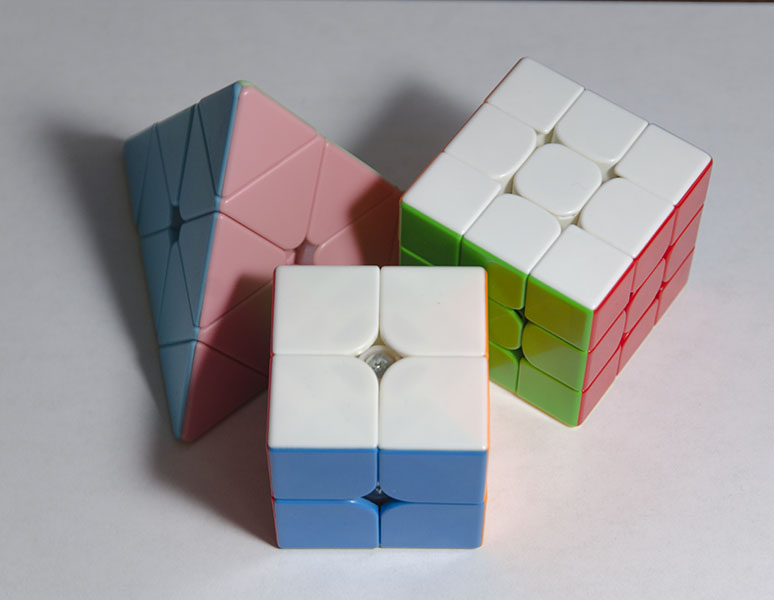
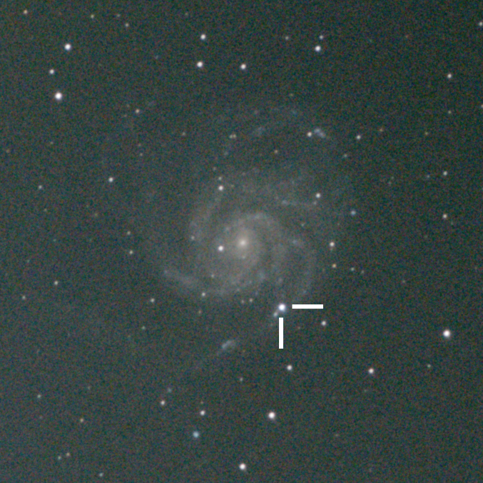
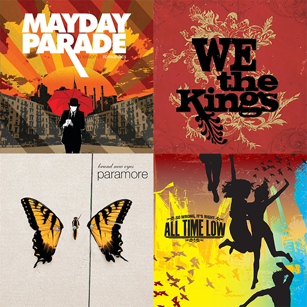
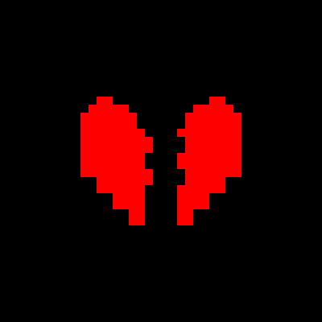
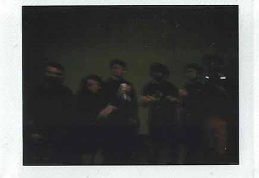
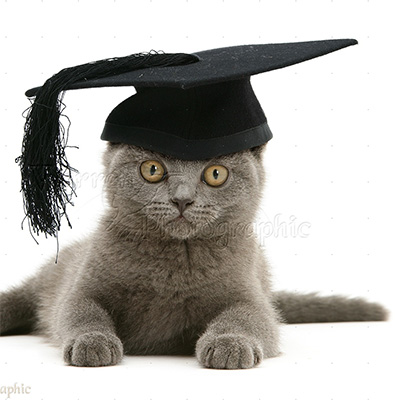
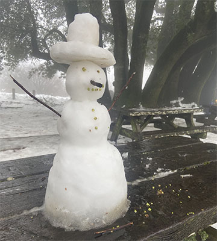

<aside class="warning">

<b>Warning!</b> Dopey contemplation ahead. Proceed at your own peril. (Also, this page might look a little fucked up on mobile&hellip; sorry)

</aside>

2023 has finally come to an end. So, I guess it's time to reflect on what a strange time these last twelve months have been.

    

        
I cubed a <i>lot</i>, racking up over 6000 timed solves, my first official average, two new puzzles, and a shiny new <a href="https://bithole.dev/cubing.html">PB</a> of 12.71 seconds.

        
    

    

        
        
I took a picture of a partial solar eclipse&hellip;

    

    

        
&hellip;a supernova&hellip;

        
    

    

        
        
&hellip;and various other things in space!

    

    

        
I got really into pop punk :)

        
    

    

        
        
I ended a relationship :(

    

    

        
I went to DEFCON again, and I met some neat people.

        
    

    

        
        
After a torturous applications cycle of rejection after rejection, I finally started college.

    

    

        
It miraculously snowed in the Bay Area, so of course I built a snowman.

        
    

    

        
        
I gave blood for the first time!

    

    

        
And most importantly, through all the triumphs and tribulations&hellip; I tweeted like my life depended on it. <i>art by <a href="https://twitter.com/87_G0D/status/1685936477967196160">@87_G0D</a></i>

        
    

This might be the part where I whine about my various misgivings about this past year, but I figure that the time has come to set them aside before they are committed to the historical record. So I'm just going to say that I still think I got a lot out of this year. I met a lot of friends, made a number of cherished memories, and discovered a lot of new interests that I would have probably never anticipated.

# Upcoming Blogposts

In writing this blogpost, I ended up referencing last year's reflection, and *wow*&mdash;I didn't do very well on my goal of finishing all the incomplete posts I listed. Oops. Here's the status update on a couple of those:

* Bitcoin Explained: dropped for lack of interest.
* ExFAT Driver in Assembly: dropped because writing real mode assembly is pretty painful.
* IP over Audio Jack: I wrote a brand new implementation using WebAudio, which was quite fun! Unfortunately the receiver has some problems, and I can't really test the program without two devices, so I probably won't be able to work on it for some time. But still&hellip; progress! I really want to finish this eventually.
* Analyzing Internet Background Noise: still on my TODO list, but low priority. 
* Optimally Solving Rubik's Cube: I will write this one when I figure out how to actually do it. 
* Minecraft Server Census 2.0: I *did* end up writing a new scanner and re-mapping IPv4 space, but the results were not really different enough to warrant a new post. So, I guess I kind of completed this one? I dunno.

Along the way, I did end up getting a lot of new blogpost ideas, some of which I am currently working on. Time has been hard to come by ever since starting college, but I still think that blogging is just a great way to share cool stuff and I want to keep doing it.

So.. stay tuned. Because there's always more to come :-)

Until next time, 
Adrian Zhang

