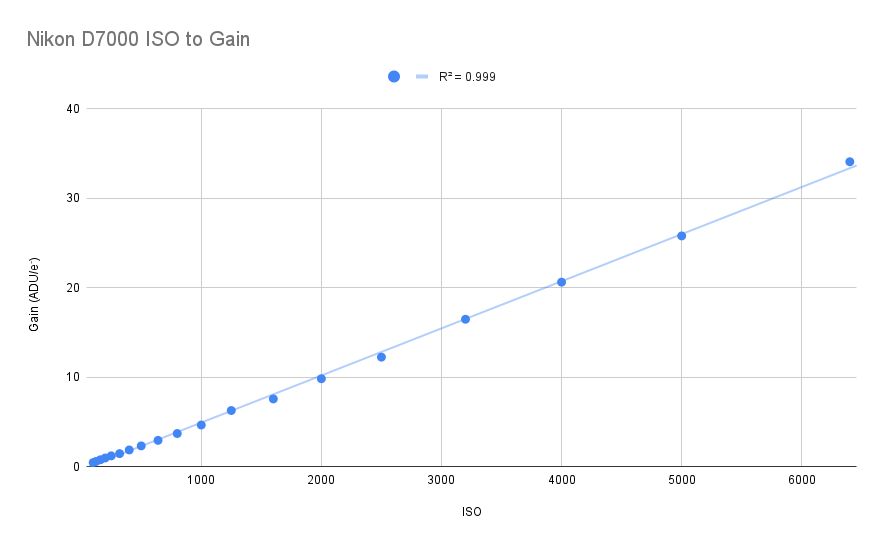

As an amateur astrophotographer, I find deep-sky objects to be some of the most rewarding targets to capture. They display a stunning range of colors and structures that exemplify the beauty of the cosmos. Their characteristics also demand highly unique imaging and processing techniques, presenting some interesting challenges that we'll be discussing today.

So&hellip; what *is* a deep sky object, exactly? Broadly speaking, "DSO" encompasses everything outside of the Solar System (besides individual stars). This category includes objects such as star clusters, nebulae, and galaxies. DSOs vary wildly in apparent size, but they generally have one thing in common: they are very faint, meaning that very long exposures are necessary to fully bring out their details.

The requirement for long exposure time brings us to our first major obstacle: objects in the sky appear to be in constant motion due to Earth's rotation. If we don't account for this, our images of the target will appear hopelessly smeared due to motion blur. The solution is to rotate our imaging setup along the *polar axis* in the opposite direction of Earth's rotation, which can be accomplished with the help of an [equatorial mount](https://en.wikipedia.org/wiki/Equatorial_mount). This will make the sky appear stationary to the camera. 

Unfortunately, tiny deviations in the mount's alignment are inevitable. As we push our exposure length longer and longer, these small errors will accumulate into trailing, which is unacceptable. This sets an upper limit on the exposure time of an individual frame. To overcome this limitation, we must combine ("stack") multiple exposures into a final image. Using many exposures also allows us to detect and exclude defects like cosmic ray hits and satellite trails from the final image.

Today, we will be writing code to perform calibration and stacking. Come along, as we dive deep into the gory details of astrophoto processing. 

# Housekeeping

Before we can get to the cool sciencey stuff, there are a few things we need to take care of. For starters, my camera (a Nikon D7000) performs some adjustments on the raw data before saving it. These adjustments will interfere with the calibration process, so I flashed a [patched firmware](https://simeonpilgrim.com/nikon-patch/nikon-patch.html) to disable them. Do this at your own risk; you could brick your camera if you're not careful!

Once we've collected our data, we need to convert it from the camera's proprietary raw format to something that our code can actually digest. The easiest solution is to use [dcraw](https://www.dechifro.org/dcraw/), an open-source raw decoder. dcraw outputs [PGMs](https://en.wikipedia.org/wiki/Netpbm), an uncompressed image format that is trivial to read. Normally, dcraw applies quite a few adjustments to transform the raw files into normal-looking images, but we want to keep the data as untouched as possible so we include a few special arguments:

```plaintext
dcraw -4 -D image.NEF
```
* `-4`: output linear 16-bit values
* `-D`: output a grayscale image; do not perform any interpolation such as [demosaicing](https://en.wikipedia.org/wiki/Demosaicing)

# All About Sensors 


Modern cameras use either CCD or CMOS sensors to detect light and produce a digital readout. While these technologies have many important differences, they function on similar principles: photosites (pixels) in the sensor are struck by photons, some of which end up producing electrons. These electrons accumulate within the photosites over the span of the exposure. At the end, the charges are converted to a voltage and then digitized by an **analog-to-digital converter (ADC)**. The amount of amplification applied is known as the **gain**, which is determined by the ISO setting.

Our images primarily suffer from three sources of noise: dark noise, read noise, and shot noise. Let's look at the processes behind these noise sources in depth, so we can effectively mitigate them.

## Shot Noise

Shot noise stems from the fact that light is quantum, meaning that rather than being radiated continuously, it arrives in discrete packets of energy called photons. Over a finite timespan, there is always some uncertainty in the exact number of photons received from the target, giving rise to shot noise. It affects all detector systems, even hypothetical perfect ones.

Check out this demo, which simulates randomly emitted particles falling onto an ideal detector. Try playing around with the exposure time, and see how it affects the signal-to-noise ratio (SNR).

<div style="display: block; margin: auto; width: 600px;">
<canvas id="shot-noise-demo" style="border: 1px solid #ccc;" width="600" height="300"></canvas><br>
<label for="exposure-time">Exposure time: </label><input type="range" min="0.5" max="4" step="0.5" value="1" id="exposure-time"><span id="exposure-time-text">
</div>

<script src="shot-noise.js"></script>

Statistically inclined readers might recognize that photon emission is a Poisson process, because events occur independently and at a fixed mean rate. Thus, the number of events observed over a fixed time interval is given by the [Poisson distribution](https://en.wikipedia.org/wiki/Poisson_distribution). When the rate of events $\lambda$ is large, the Poisson distribution is closely approximated by a normal distribution with $\mu = \sigma^2 = \lambda$. Thus, we can say that the variance of the number of electrons is equal to the average number of electrons. If we define signal-to-noise ratio as mean over standard deviation, this relation also explains why we need to quadruple our exposure time to double our SNR.

Of course, our RAW files don't tell us how many electrons were produced within the pixels. Instead, they contain arbitrary integer quantities representing the output of the ADC. It doesn't make sense to assign a physical unit to these values, so for the sake of clarity we measure these values in **analog-to-digital units (ADUs)**. There is some factor that gives the electrons per ADU, which we call the **gain**.

The signal statistics in ADU and electrons are related by:

$$\mu_\text{ADU} = \frac{\mu_\mathrm{e^-}}{\mathrm{gain}}$$

$$\sigma_\text{ADU} = \frac{\sigma_\mathrm{e^-}}{\mathrm{gain}}$$

We know that $\sigma_\mathrm{e^-} = \sqrt{\mu_\mathrm{e^-}}$ due to shot noise, allowing us to solve for gain:

$$\mathrm{gain} = \frac{\mu_\mathrm{ADU}}{\sigma^2_\mathrm{ADU}}$$

Using this method, we can calculate the sensor gain for various ISO values. We see that there is a strong linear relationship.



At around ISO 200, we reach **unity gain**, where 1 electron corresponds to 1 ADU. (Note that these estimates are probably slightly underestimated since we have not accounted for variation due to other sources of noise, but this blogpost is long enough already&hellip;) We'll use these gain measurements later when measuring other sensor properties.

## Dark Noise

Even in the absence of light, the photosites within a sensor will still produce some electrons due to thermal effects. This unwanted signal is known as **dark current**. Different pixels produce dark current at different rates, a phenomenon called **dark current non-uniformity (DCNU)**. Of course, dark current is also subject to shot noise, causing it to vary randomly.

<figure style="max-width: 500px">
    <!---->
    <figcaption>Shot noise in the dark current is approximately normally distributed, as expected.</figcaption>
</figure>

Dark current accumulates within the sensor at a steady rate, which is usually measured in electrons/pixel/second. This causes the dark current level to vary linearly with exposure length:

TODO-Chart

Dark current is also related to temperature. I tested this effect by putting my camera in the freezer, waiting until it reached thermal equilibrium, and comparing the low-temperature dark frames to ones taken at room temperature.

TODO-Chart

Many dedicated astronomy cameras feature built-in cooling to minimize dark current for this reason.

## Read Noise

There is also a small amount of unwanted signal that is produced by the amplification and ADC circuitry. The level of read noise is primarily determined by the sensor gain/ISO.

TODO-Chart

# Calibration

Now that we understand all the problems affecting our image, we can start getting rid of them. We'll start with dark current and read noise. The level of these two signals can be estimated by taking exposures at the same length and ISO as our light frames, but with the lens cap on. We will then combine these **dark frames** into a single master dark frame that we subtract from each light frame. Here's how the image looks after dark frame subtraction:

Now let's zoom out&hellip;

&hellip;yikes. We've got some pretty severe vignetting! This generally happens because our optics transmit less light towards the edges of the image. On a smaller level, our images also suffer from **photo response non-uniformity (PRNU)**, where different pixels have different sensitivity to light. We can correct both of these problems by taking pictures of a uniform source of illumination. This yields a **flat frame**, which we can divide our image by to neutralize the vignette and PRNU.

Of course, the flat frames themselves need to be calibrated. Specifically, we need to take dark frames using the same settings as the flat frames and perform dark-frame subtraction.

## Flat-field Corrections

# Alignment

# Stacking

# Post-processing

