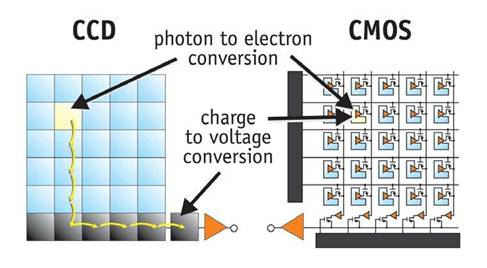

As an amateur astrophotographer, I find deep-sky objects to be some of the most rewarding targets to capture. They display a stunning range of colors and structures that exemplify the beauty of the cosmos. Their characteristics also demand highly unique imaging and processing techniques, presenting some interesting challenges that we'll be discussing today.

So&hellip; what *is* a deep sky object, exactly? Broadly speaking, "DSO" encompasses everything outside of the Solar System (besides individual stars). This category includes objects such as star clusters, nebulae, and galaxies. DSOs vary wildly in apparent size, but they generally have one thing in common: they are very faint, meaning that very long exposures are necessary to fully bring out their details.

The requirement for long exposure time brings us to our first major obstacle: objects in the sky appear to be in constant motion due to Earth's rotation. If we don't account for this, our images of the target will appear hopelessly smeared due to motion blur. The solution is to rotate our imaging setup along the *polar axis* in the opposite direction of Earth's rotation, which can be accomplished with the help of an [equatorial mount](https://en.wikipedia.org/wiki/Equatorial_mount). This will make the sky appear stationary to the camera. 

Unfortunately, tiny deviations in the mount's alignment are inevitable. As we push our exposure length longer and longer, these small errors will accumulate into trailing, which is unacceptable. This sets an upper limit on the exposure time of an individual frame. To overcome this limitation, we must combine ("stack") multiple exposures into a final image. Using many exposures also allows us to detect and exclude satellite trails from the final image.

Say we've acquired the data&mdash;what now? Well, this is where the fun begins.

# Calibration

All modern DSLRs use either CCD or CMOS sensors to detect light and produce a digital readout. While these technologies have many important differences, they function on similar principles: photons strike photosites (what we call pixels) in the sensor, producing charges that are amplified and then digitized by an **analog-to-digital converter (ADC)**.

As a result, the noise produced by CCD/CMOS systems can be broken down into two categories:

- **dark noise**, which is the product of charges spontaneously generated within the sensor
- **read noise**, which is generated within the amplifiers and ADC

There is one additional source of noise in our images: **shot noise**. It stems from the fact that light is quantum, meaning that rather than being radiated continuously, it arrives in discrete packets of energy called photons. Over a finite timespan, there is always some uncertainty in the exact number of photons received from the target, giving rise to shot noise.

As an analogy, consider a bucket in the rain. If we were to repeatedly count the number of raindrops that fell into the bucket over a one-minute period, the number of drops would change from minute to minute, even if the overall rate of rain remained constant. The same holds for photons arriving at our detector. Even a perfect sensor is still constrained by shot noise.

<aside>

From a calibration perspective, there's nothing we can do to correct for shot noise, because it's an inherent part of the signal.

Shot noise follows a [Poisson distribution](https://en.wikipedia.org/wiki/Poisson_distribution), which describes the number of times an event occuring at a constant mean rate is expected to occur in a fixed interval.

</aside>

## Dark Noise

## Read Noise

## Flat-fielding

# Alignment

# Stacking

# Post-processing

