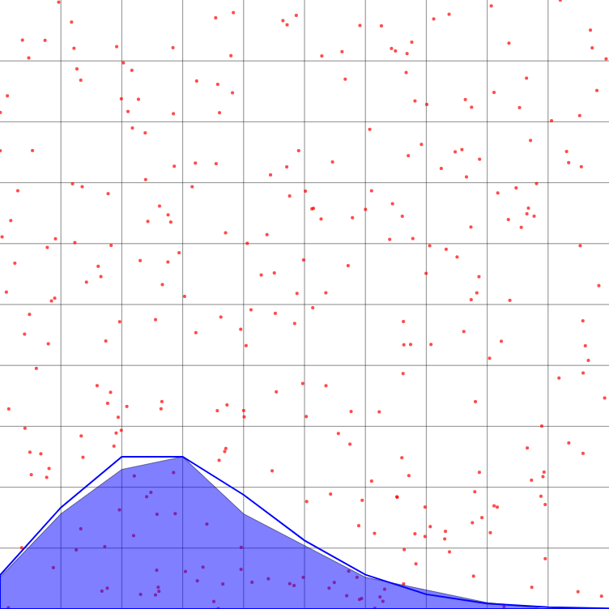

For this first thought experiment, forget about the telescope or ISO or any of those parameters. Imagine a single pixel that exactly counts every photon that falls onto it; no more, no less. In other words, a perfect detector. Yet if we point this sensor at a light source of fixed intensity and take a series of exposures, the measurements will still vary! The reason is simple: the time between photon arrivals is random, creating noise that affects even a ideal detector. This type of noise is known as *shot noise*, and in most cases, it is the largest source of noise in an image.

{TODO: animation of photons falling onto sensor w/ measurements over time}

