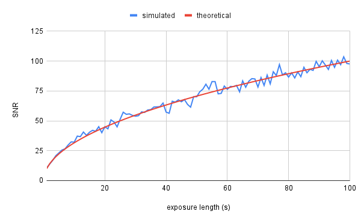

As an amateur astronomer, my favorite class of objects is definitely the *deep-sky objects*. This category includes anything outside of the solar system besides individual stars, so think nebulae, star clusters, and galaxies. DSOs offer a stunning range of colors and shapes that make them, in my opinion, some of the most beautiful sights the cosmos has to offer. So, naturally, I wanted to take some pictures of them!

Due to their diversity, it's hard to make blanket statements about DSOs, but the following is true for most deep-sky targets: they are very dim, and often quite small. This makes imaging them quite a challenge; if you've ever researched or attempted it, you may know that the most widely taught method is quite an unusual ritual with a lot of steps whose purpose is not fully explained. The goal of this article is to deconstruct the theoretical basis of deep-sky astrophotography.

# Noise

DSO AP boils down to detecting a faint signal in a noisy environment. If the noise 

## Shot Noise

For now, forget about the telescope or ISO or any of those complications. Imagine a single pixel that counts every photon that falls onto it; no more, no less. In other words, a perfect detector. Yet if we point this sensor at a light source of fixed intensity and take a series of exposures, the measurements will still vary! The reason is simple: the time between photon arrivals is random, creating noise that affects even a ideal detector. This type of noise is known as *shot noise*, and in most cases, it is the largest source of noise in an image.

{TODO: animation of photons falling onto sensor w/ measurements over time}

Shot noise follows a [Poisson distribution](https://en.wikipedia.org/wiki/Poisson_distribution), but under many conditions, it can be approximated as a normal distribution with equal mean and variance. Standard deviation is defined as the square root of variance, so we have:

$$\mathrm{SNR} = \frac{\mathrm{signal}}{\sqrt{\mathrm{signal}}} = \sqrt{\mathrm{signal}}$$

I tested this by simulating exposures of a source randomly emitting photons at a rate of 100 photons/second. The results match very well with the predicted SNR:

The big takeaway from this relationship is that to minimize the effects of noise, you want to maximize the amount of signal arriving at your sensor. To accomplish this, you have a few options:
- Use a longer exposure
- Open up your aperture more
- Illuminate the scene with more light (this is obviously not an option for astrophotography)

Of course, real sensors hardly conform to the idealized model described earlier. Rather, they suffer from a number of imperfections that are also important to consider.

## Dark Current

If you click the shutter with the lens cap on and viewfinder blocked, you will get... a black picture. No big surprise there. But if you examine the pixel values in this image, you'll find that they are not zero. Rather, there is a small signal is present even when there is no light incident on the sensor. This signal is called *dark current*, and it is the result of minuscule defects in the pixel causing spontaneous production of electrons independent of any light falling on the sensor. Different pixels generate dark current at different rates; some outlier "hot pixels" generate dark current at especially high rates. And because the production of dark current electrons is a fundamentally random process dark current will also vary randomly due to shot noise.

{TODO: dark frame showing dark current}

As before, the only way to reduce the random component of dark current is to take more exposures. However, we can estimate the level of dark current for each pixel by taking a series of dark frames (frames where the sensor is not exposed to any light), averaging them, and subtracting the result from our light frames. This eliminates the random contribution 

While we usually don't think of it as noise, light pollution, in a way, fits the bill: it's an unwanted, randomly varying signal that is present in our measurements.

## Read Noise