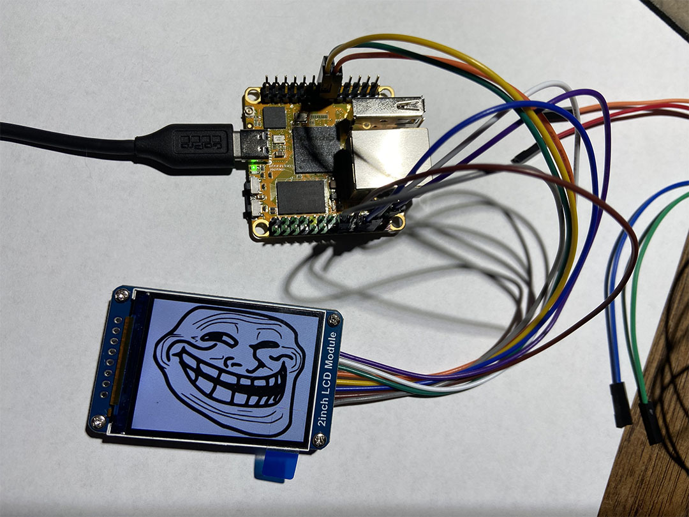

I had a spare [RockPi S](https://wiki.radxa.com/RockpiS) lying around from a previous project, so I decided to use it for my prototype. It's a little single-board computer powered by a 64-bit ARM SoC, so kind of like a Raspberry Pi.

The first part to arrive was a little LCD screen, so I decided to try and get that working first. Unfortunately, I am a total n00b when it comes to electronics and embedded systems, so I spent an unnecessary amount of time and money trying to accomplish this simple task. What follows is an account of how I repeatedly shot myself in the foot while stumbling around in the darkness of my ignorance. (Hopefully my suffering will bring you some laughter.)

I initially expected things to be simple. Hook up the right pins to the right headers, and we're done. I made one fatal mistake, however: I underestimated my ability to screw up even the most trivial of tasks. My proficiency at turning a simple procedure into a long, torturous slog really can't be overstated.

Right at the outset, things started off on a funky note. According to the documentation, the RockPi has two SPI buses, although the pinout clearly claims the existence of three. The SCLK and CS pins for SPI0 are, puzzlingly, missing, however, so I went with SPI1. The LCD module also requires a couple GPIO pins, so I had to modify the vendor's code (which was written for a Raspberry Pi).

At this point, I decided that we were ready to take the whole contraption for a spin. I ran the test program, and&mdash;what's this? Oops, looks like we forgot to enable spidev. No biggie, just a quick edit to uEnv.txt to enable the right device tree overlay and we'll be back on our feet. (Suspiciously, the device tree docs claim that the board only has *one* SPI bus.) I reboot the board, thinking nothing of it, and wait for the light to come on. And wait. And wait&hellip;

Well, it looks like that quick edit rendered the system unbootable. Some research confirms my stupid mistake: I forgot to remove the uart0 overlay, which uses the same pins and thus can't be enabled at the same time. No matter, I can just revert the change, and we can figure out what went wrong from there. One small problem though: my Windows desktop won't mount the boot partition for some reason, even though it's VFAT. *Ugh*. I'm too tired to try and wrangle with Bill Gates' satan-spawn today, so I dig out the old Linux laptop from the server closet (which also functions as a regular closet), only to realize it doesn't have a MicroSD reader.

*I would laugh if it weren't so tragic.*

That's okay, there's a MicroSD adapter somewhere in the house, but where, where? After a short frenzied search, I finally find an adapter in an old pile of cables. I spring into action, plugging it into the laptop and mounting the boot partition at record speed, but what's this? Mounted as read-only? **Why?!?** I take out the MicroSD adapter, only to realize that the god damn read lock has broken off, rendering it permanently unwriteable.

*Sigh*. I can almost hear my inner Luddite protesting. At that moment, I am more than ready to adopt his ways and lay waste to every electronic device within reach, but I'm stronger than that. Deep breaths.

Remarkably, a broken read lock can be fixed by simply jamming some tinfoil into the empty slot where it once lived. At last, I can mount the boot partition, fix my mistakes, and finally run the damn test program.

Of course, the screen doesn't work. No smoke, though, and at least the backlight comes on. At this point I'm not really sure what's wrong, besides the fact that data is clearly not making it to the screen. After a bit of fruitless tinkering, I bit the bullet and ordered a cheap logic analyzer so I can actually troubleshoot what's going on.

<i>Two days later&hellip;</i>

The logic analyzer is here. I eagerly hook it up to the board and fire up PulseView, only to be greeted with a whole lot of nothing. *Nothing.* Nothing on MOSI, nothing on SCLK even. What the hell?

It's at this point that I start looking at the pinout more carefully, and my heart starts to sink. It was the damn orientation. I was looking at the pinout chart upside-down. I can't believe such an utterly *stupid* mistake cost me so much time and sanity. At least I ended up acquiring a tool that will probably come in handy again in the future. And, well, I got the damn screen working.

<figure style="max-width: 500px">
    
    <figcaption>0/10. Would not recommend.</figcaption>
</figure>
