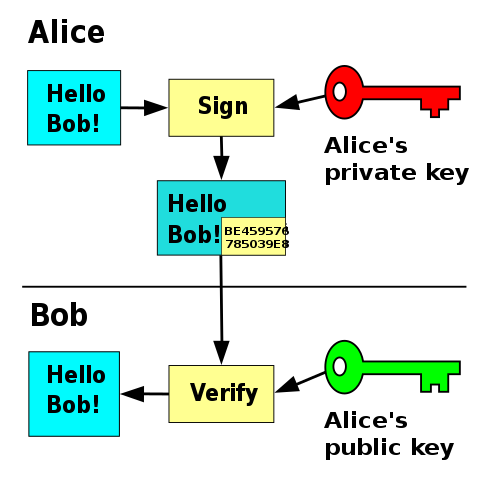
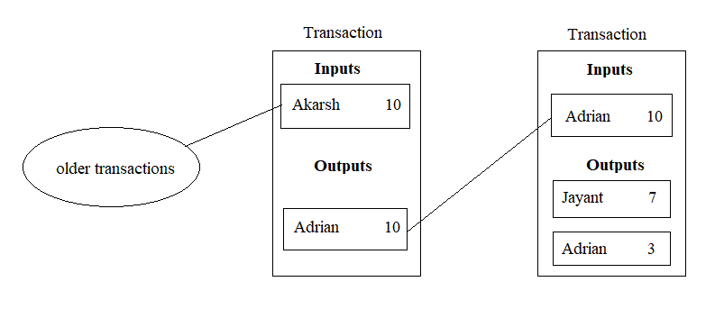
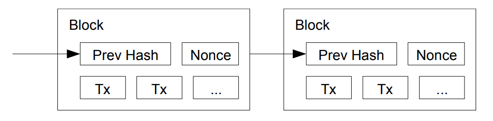

If you're anything like me, you might've heard of this thing called [Bitcoin](https://en.wikipedia.org/wiki/Bitcoin) before. Whether it's of any use as a payment system is *extremely* contentious, but as a CS nerd I find the principles that make it work pretty interesting.

The key difference between Bitcoin and a conventional payment system is that there is no central authority responsible for coordinating transactions in Bitcoin. This has two major advantages:

* No central organization can exercise control over your Bitcoin funds.
* Transactions do not need to be tied to a real-world identity; for technological purposes, they are completely pseudonymous.

This leaves one question unanswered, though: how exactly can a payment system work without a central authority? Let's find out.

# The Ledger

Suppose that I (Adrian) and three other friends&mdash;we'll call them Jayant, Akarsh, and Izaan&mdash;want to create a decentralized payment system. We come up with a simple scheme: whenever one of us makes a transaction, we will record it in our personal ledger and relay it to another member of the network, who will repeat this process until everyone has seen the transaction.

This works fine, initially; we can keep track of how much money each person has by finding the difference between how much money they've received and how much money they've sent. This way, attempts to spend more money than one actually has can be rejected. However, this scheme has some major problems.

**Transaction Authenticity**

Anyone can make a transaction as anybody else. For example, Jayant could fabricate a transaction where I send him all of my funds, and broadcast it to the network. This is obviously unacceptable, but it's actually easily solved with cryptography.

## Digital Signatures

<figure style="max-width: 491px">
    
    <figcaption>A diagram of a public-key digital signature scheme. <a href="https://en.wikipedia.org/wiki/File:Private_key_signing.svg">Image</a> by <a href="https://commons.wikimedia.org/wiki/User:FlippyFlink">FlippyFlink</a> / <a href="https://creativecommons.org/licenses/by-sa/4.0/deed.en">CC BY-SA</a></figcaption>
</figure>

Thanks to the magic of cryptography, there are schemes which allow you to produce a digital signature which anyone can verify but no one can forge. Here's how it works:

* First, the signer generates a value known as a private key. An algorithm is used to derive the corresponding public key. The keypair has the property that you cannot determine the value of the private key from the value of the public key, so it is safe to distribute the public key.

* To sign a message, the signer feeds the message and the private key into a signing algorithm, which produces a digital signature. This signature can then be distributed alongside the message to prove its authenticity.

* Anyone can input the message, the signature, and the signer's public key into a verification algorithm. The verification will fail if the message has been altered or the signature is not valid.

Digital signatures can help us secure our transaction system against impersonation. We can switch to using public keys instead of names instead of identities. By requiring that each transaction contains a valid signature, we make it essentially impossible for someone to create transactions as someone else.

However, digital signatures do not fully solve our problems. For example, if I made a transaction sending Akarsh some money, he could simply rebroadcast the same transaction as many times as he'd like, executing a [replay attack](https://en.wikipedia.org/wiki/Replay_attack). We can fix this scheme by embracing the notion of unspent transaction outputs.

## Unspent Transaction Outputs

In the Bitcoin protocol, each transaction is an entity with inputs and outputs, where every input references the output of a previous transaction. By mandating that a given output can only be spent once, we can prevent replay attacks from succeeding. This also simplifies transaction validation, since nodes can simply maintain a list of unspent transaction outputs ([UTXOs](https://en.wikipedia.org/wiki/Unspent_transaction_output)) instead of going through every single transaction in the ledger.

Here's an example of how UTXOs work. Suppose Akarsh sends me 10 coins. He would create a transaction with one of his UTXOs as the input and an output sending 10 coins to my public key. If the value of the UTXO was more than 10 coins, he would include another output to convert the unspent part of the input to change. Now, if I wanted to send 7 coins to Jayant, I would create a transaction with the output of the prior transaction as the input. The new transaction would have two outputs, one addressed to Jayant worth 7 coins, and one addressed to me worth 3 coins. 

<figure style="max-width: 793px">
    
    <figcaption>A visual representation of the exchange, totally not drawn in MS Paint.</figcaption>
</figure>

The final problem we need to tackle is how to make sure that every output can only be spent once. Let's see how Bitcoin accomplishes this.

# Double Spending and Consensus

Double spending is a problem that is largely unique to decentralized payment systems like Bitcoin. If I buy something using a five-dollar bill, I could not possibly spend those five dollars *again* because I'm no longer in posession of the physical note. But the Bitcoin network suffers from incomplete knowledge: because messages have to be relayed from node-to-node, the order which members of the network receive transactions can vary wildly. 

Without some mechanism to ensure consistency across the network, our payment system would not be usable. Suppose Jayant and I both operate online businesses which accept our hypothetical cryptocurrency. Izaan could create two transactions, one to me and one to Jayant, and send them both into the network at the same time. Nodes which receive his transaction to me first will reject the one to Jayant, and nodes which receive his transaction to Jayant first will reject the one to me. Essentially, there is disagreement about the order of transactions. Without resolving conflicts like this, the network cannot function.

One logical solution to this problem is to take a vote. All nodes will accept the most popular option, and the network will come to agreement about the state of the ledger. But how do we allocate these votes? A naive solution would be to assign each host/each IP address one vote, but as explained in the Bitcoin whitepaper, this has obvious pitfalls:

> If the majority were based on one-IP-address-one-vote, it could be subverted by anyone able to allocate many IPs. 

The way Bitcoin gets around this problem is insanely clever (in my book), but it is also the #1 contributor to Bitcoin's inefficiency and high environmental impact. Here's how it works.

# Blockchain and Proof of Work

<figure style="max-width: 1022px">
    
    <figcaption>The blockchain, as depicted in the Bitcoin whitepaper, in all its unadulterated glory.</figcaption>
</figure>

To understand proof of work, we must first graduate from the concept of the ledger to the [blockchain](https://en.wikipedia.org/wiki/Blockchain). The purpose of a blockchain is to aggregate transactions into larger units, in order to reduce the amount of overhead expended on achieving consensus. 

The foundation of proof of work is the [cryptographic hash function](https://en.wikipedia.org/wiki/Cryptographic_hash_function), or just a hash. Cryptographic hashes are functions which take an input of any size and output a fixed-size hash. For our purposes, these functions have a couple of important properties:

* It is very difficult to determine the input based on the output.
* As a corollary, it is very difficult to determine which input will produce a specific output.

Bitcoin is built around the [SHA-256](https://en.wikipedia.org/wiki/SHA-2) hash function. SHA-256 is one, if not *the* most widely used cryptographic hash functions; it has withstood over 20 years of cryptanalysis while still remaining secure.

During normal operation of the network, nodes known as *miners* continually accept incoming transactions and validate them. Then, they combine the transactions into blocks and attach a couple of fields to create a new block header. A block header contains the following fields:

* A version number
* The hash of the previous block in the chain
* The hash of all the transactions contained within the block
* The time at which the block was mined
* The target
* The nonce

TODO: Talk about Merkle trees and SPV.

Since each header contains a reference to the previous header in the form of a cryptographic hash, the blockchain can be thought of as a singly linked list of block headers.

There are two fields here whose meaning is not self-evident: the target, and the nonce. Both have to do with the **mining** process, which is how new blocks are generated. Essentially, there's a 256-bit value called the *target*, which every node calculates independently based on previous blocks. The job of the miner is to repeatedly adjust the nonce and recalculate the SHA256 hash of the block header until its value is lower than the target. This process is very computationally intensive, and since there's no way to cheat, a valid block header whose hash is lower than the target can be considered *proof* that whoever mined that block has expended the necessary processing power.

<aside>

To incentivize mining, miners are allowed to include a **coinbase transaction** in each block, crediting themselves with a certain amount of Bitcoin as a reward for their efforts. Coinbase transactions have non-zero outputs but no inputs, so they are how new Bitcoins are introduced into the system. 

The maximum amount which a miner can claim from a new block is hard-coded into all nodes on the network. The reward from the first block was 50 Bitcoins; subsequently, the reward is halved every 210,000 blocks. Nodes will reject blocks where the miners try to reward themselves too much Bitcoin.

</aside>

What purpose does this serve? Requiring each block to contain a proof of work ensures that in order to override the consensus of legitimate nodes, an attacker would need to mine blocks faster than the rest of the network, which is nothing short of a Herculean feat.

It can be shown that proof-of-work effectively addresses the double spending problem. Let's go back to the race attack from earlier, where we've created two conflicting transactions and broadcast them simultaneously. Each miner will accept only one of the conflicting transactions to be included in a block. Eventually, one miner will "win", and other miners will forget the other transaction to work on the longest chain.

This is what makes Bitcoin transactions irreversible: to replace an old block, you'd need to create a new blockchain with more work put into it than the primary chain. The difficulty of performing such an attack increases rapidly over time. As a result, the older the transaction is, the harder it is to reverse. As a rule of thumb, once a transaction has 6 "confirmations" (6 blocks mined after the one it was included in), it is considered irreversible. However, transactions with 1 or 0 confirmations are not necessarily set in stone.

# Difficulty Adjustment

Since the creation of Bitcoin, more and more miners have joined the network, causing the rate at which blocks are being attacked to increase tremendously. As of the writing of this article, the Bitcoin network performs around around 225 exahashes per second, which is an unimaginably large number. For reference, 225 exaseconds is equal to approximately 7 trillion years. If the target remained constant, so many blocks would be mined per second that the network would surely cease to function.

To counteract this, every 2,016 blocks, every Bitcoin node will perform a **difficulty adjustment** to calculate the new target value. The calculation takes into account the timestamps of previous block headers and adjusts the target such that the average time between blocks will be 10 minutes.

<aside>

Since block times are critical to determining the difficulty of the network, the Bitcoin client uses some heuristics to reject blocks with grossly manipulated timestamps:
* The timestamp of a new block must be greater than the median of the last 11 blocks.
* The block cannot be more than two hours ahead of the network-adjusted time, which the node determines by looking at timestamps sent by its peers.

As you can see, these rules are fairly lax, so block timestamps tend to be fairly inaccurate. There is no guarantee that they increase monotonically, and some miner pools are known to intentionally bias their timestamps for one reason or another.

For more info on the implementation details, check out [chain.h](https://github.com/bitcoin/bitcoin/blob/b25a752dfdbb12fd579e1dbef2bb95096867046b/src/chain.h#L288) and [timedata.cpp](https://github.com/bitcoin/bitcoin/blob/master/src/timedata.cpp).

</aside>

# Weaknesses and Attacks

Bitcoin works remarkably well, but the nature of its construction means that there are many weaknesses inherent to its design. Here, I'll be introducing what are (in my opinion) some of the most significant flaws associated with Bitcoin.

## Lack of Anonymity

This may come as a surprise, but Bitcoin is not anonymous. It's not inherently associated with your real-world identity like most conventional payment systems, but at the same time, all of your transactions are public. Combine that with the fact that many exchanges require various forms of PII when purchasing Bitcoin using fiat currency, and it becomes clear that you need to take extra measures to ensure your privacy when using Bitcoin.

## Sybil Attack

If an attacker managed to isolate your node from the network such that you were *only* connected to attacker-controlled nodes, it would make a double-spending attempt easier since the attacker would no longer need to compete with the rest of the network; since they control what blocks you see, .

# Script

# Forks in the Road

# SegWit and the Lightning Network

# References

* [Satoshi Nakamoto - Bitcoin Whitepaper](https://bitcoin.org/bitcoin.pdf)
* [Bitcoin-Akka (full Bitcoin implementation in Scala with commentary)](http://hhanh00.github.io/bitcoin-akka-tutorial/index.html)
* [Bitcoin.org Developer Documentation](https://developer.bitcoin.org/devguide/index.html)
* [Andreas Antonopoulos - Mastering Bitcoin](https://aantonop.com/books/mastering-bitcoin/)