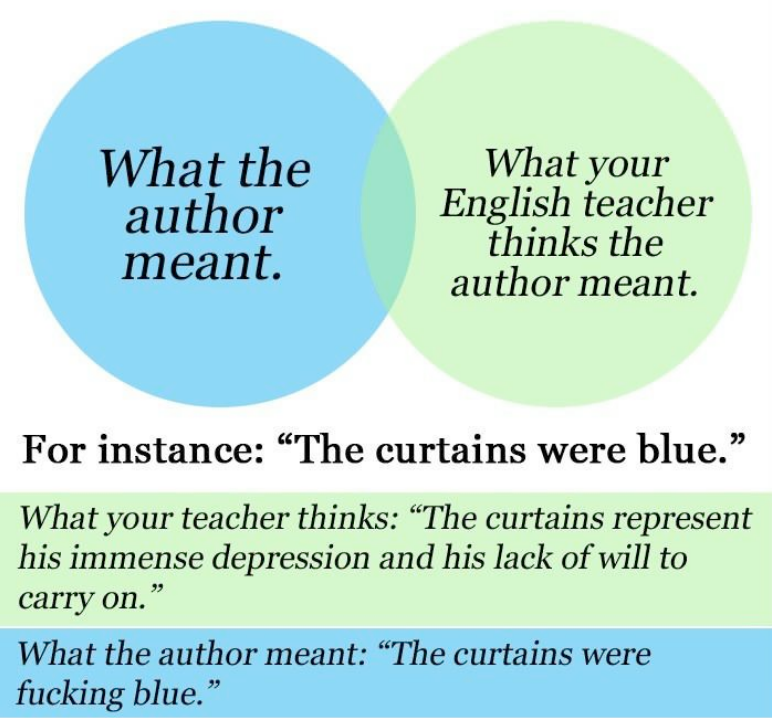

English was never my favorite subject.

If you are a lover of language, don't close the tab quite yet&mdash;this is not another bitter tirade about the horrors of being forced to choke down Shakespeare. I am here to talk about a cognitive "trap" that many jaded English students find themselves caught in. The following meme is a good litmus test for whether you suffer from the affliction:

For many, this is an all-too-familiar experience, a symptom of exposure to the production-line mode of education. Pretend to read the book, struggle to stay awake as the teacher pontificates about what some dead author meant by something or the other, and regurgitate those sacred words when it comes time for testing. But *this is not how things out to be*, and it is a real shame that so many wonderful insights and revalations are crushed under the heel of such drudgery.

Let's start from first principles. Yes, the curtains are blue for a reason. Authors are humans1, and as beings capable of conscious thought, all of our decisions incorporate *some* kind of reasoning (however intangible it may be). But we as readers are not omniscient beings, so we can never truly understand the innumerable factors that led the author to bring those blue curtains into existence. Yet when teachers speak of authorial intent, they often do so with an air of objectivity. Students are left with a lingering sense of incongruity that eats away at their faith in the validity of the material, leading them to conflate evidence-based argumentation with sheer speculation. After all, in every other class, there is a clear demarcation between what is true, what is not, and what is unknown. English, by contrast, appears to be paralyzingly open-ended yet simultaneously bound by strict unspoken rules&mdash;a tough nut to crack for sleep-deprived teenagers forced to divide their attention between derivatives and Dostoevsky. 

Unsurprisingly, the result is that students choose to economize. Rather than spending time developing the skills to craft compelling literary arguments, they train themselves to synthesize sufficiently convincing drivel. It's the path of least resistance, and any rational person in their place would do the same.

The blame for this failure can be escalated as far up as you'd like. Perhaps it is an indictment of not just English instruction but also education as a whole. After all, there's only so much teachers can do to remedy these problems within the confines of the system. When it comes to truly reinventing the way literary criticism is taught, their hands are tied. The building blocks of literature are bastardized to fit into an assessment-centered framework. This phenomenon is exemplified by the "Easter Egg" hunt for symbolism, where students are tasked with connecting arbitrary motifs to "themes" (significance be damned). No wonder so many high schoolers report hating reading.

So, what to do, short of broad-sweeping education reform? I believe there is value in acknowledging that the unknowability of authorial intent does not preclude a meaningful investigation of a work of literature. Words do not die when they are put to paper; they are rejuvenated when they are read by humans, complete with their biases and heuristics. Some scholars may disagree, but the assertion that underpins my view of literary criticism is that any *defensible* interpretation of a work bears merit, even if it could not have possibly been the intention of the author. Such extrapolation is a major part of why we *read* in the first place. Successful criticism is an exercise in not just a complete understanding of the relevant historical and societal factors, but also the synthesis of novel viewpoints through logical deduction. Force students to take sides&mdash;there is no better motivator than competition, and the resulting rebuttal and refutation will naturally produce sophisticated, in-depth dialog.

Lastly, down with dogma. Even if there was a *certain* answer to why the author made the curtains blue, it would be of no importance whatsoever. The point is not to solve the mystery and arrest the murderer, it is to develop an arsenal of language and reasoning tools that enable one to engage with a text in its **entirety**. Literature is the lens through which we achieve that end. And it's about time we gave it the treatment it deserves.

---

1 Except when they aren't. Artificial "intelligence" presents an entire world of complications that will have to wait for some other sleepless night.