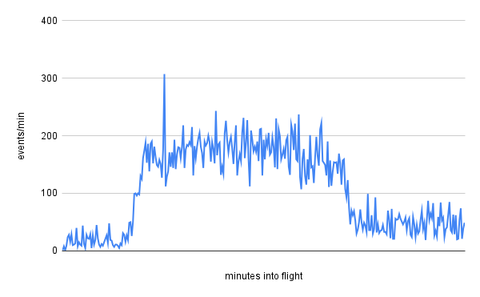

This is a quick follow-up to last year's blogpost on [cosmic rays](https://blog.bithole.dev/blogposts/cosmic-ray/). If you haven't seen that one yet, I highly recommend checking it out, and I'm not just saying that because I wrote it ;)

Like millions of other Americans, I headed out to the [middle of nowhere](https://en.wikipedia.org/wiki/Austin,_Texas) a few weeks ago to witness a total eclipse of the Sun&mdash;but I also used that opportunity to hunt down another interesting astronomical phenomenon! Since I made the trip by plane, I thought that it would be cool to observe increased cosmic ray flux in the upper atmosphere, which was how they were initially determined to be of extraterrestrial origin.

I don't have any devices designed for the measurement of ionizing radiation, but I do have a camera that can take pictures automatically. It turns out that charged particles are quite capable of activating the pixels in any camera's sensor, allowing one to be used as a crude particle detector. So, before I boarded my flight, I set my camera to record one 60-second exposure after another, leaving me with 320 images spanning from takeoff to landing.

But enough talk, here's the data:

I was honestly surprised to see that the experiment had actually worked, but it's pretty hard to argue with that trend! The huge spike was probably caused by this particle, which left quite an impressive track:

And if you're not happy with just one dose of radiation, I also made my phone record its journey through the airport's X-ray machine.

<iframe width="560" height="315" src="https://www.youtube-nocookie.com/embed/penNi1pGmiw?si=OYGkxegSKm5P3qXf" title="YouTube video player" frameborder="0" allow="accelerometer; autoplay; clipboard-write; encrypted-media; gyroscope; picture-in-picture; web-share" referrerpolicy="strict-origin-when-cross-origin" allowfullscreen></iframe>