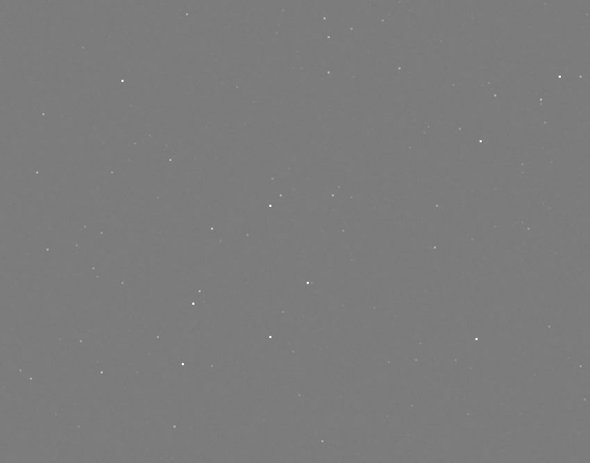
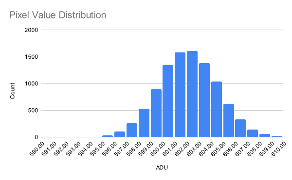

A blogpost? In this economy?! Yes, that's right. Today, we're going to be looking at how you can use an unmodified digital camera to detect cosmic rays. 

{TODO: Cosmic rays}

First, what *is* a cosmic ray? Put simply, they're not actually "rays"; rather, they are high-energy particles, usually protons, that have found their way to Earth. Some come from the Sun, while others originate from outside our Solar System or even other galaxies.

We call the original particle a primary cosmic ray, because it generally doesn't make it to the surface. Instead, when it collides with atoms in the atmosphere, a shower of secondary particles is produced. These particles are the ones which we'll be detecting. 

Speaking of which, how do we actually go about observing these particles? Well, it turns out that all you need is a plain old camera. As a charged particle flies through the silicon detector inside, electrons are ripped from the atoms of the photosites, producing charges that can be read out just like a regular image. This is also responsible for the speckles that often appear in photos of radioactive materials.

<figure style="max-width: 500px">
    
    <figcaption>&#9835; Dumb ways to dieee... &#9835;</figcaption>
</figure>

Anyways, the procedure is very simple. Just put the lens cap on your camera, put it in a dark place with the sensor facing the zenith (straight up), and leave it to take some pictures. With a little luck, you'll be greeted by some cosmic ray tracks in your images when you come back!

A few words about camera settings:
- In theory, a shorter exposure length offers many advantages, such as increased temporal resolution and less dark current. However, this comes at the cost of more data to process. I also didn't want to cause too many shutter actuations, so I settled for an exposure length of 1 minute.
- I used an ISO of 200, which corresponds to unity gain (i.e. 1 electron equals 1 ADU) on my camera. ISO 100 would probably work well too. In general, a lower ISO is preferred since read noise is not a significant concern. 

One last tidbit: my camera, a Nikon D7000, applies some transformations to raw images such as black-point subtraction and channel scaling. This is great for photographic data, but for our purposes it's highly unwanted. Thankfully, there is a free [tool](https://nikonhacker.com/viewtopic.php?t=2319) that instructs the camera to skip any of these adjustments.

As a bonus, this hack will also make the camera include the optical black pixels in the saved image. These pixels reside on the edge of the sensor and are blocked from receiving any light. Normally, they are used to calibrate the sensor's black point and are cropped from the final image, but cosmic rays can pass right through the opaque layer. Thus, we actually gain a tiny bit of extra detector area. 

# Post-processing

I left my camera snapping away overnight, and woke up to 348 images. Let's open them up and take a look!

Upon first inspection, the images look totally black, which is hardly surprising. You took a picture with the lens cap on. What did you expect? 

If we crank up the exposure a lot, some patterns start to appear:



Wow, are those all cosmic rays? *No.* If you open up another exposure and go to the same spot, you will see the exact same patterns.

What we're dealing with is hot pixels. Over time, electrons are spontaneously produced within the photosites due to thermal fluctuations, producing what is known as *dark current*. For most pixels, this is contained at about 0.1 electrons per second. However, due to flawed manufacturing, some pixels exhibit much higher dark current than others, manifesting as hot pixels.

This phenomenon means that trying to identify cosmic rays by looking at a single frame at a time will yield unreliable results. A much better strategy is to analyze the value of a single pixel across frames. Hot pixels will remain hot, whereas a genuine cosmic ray hit will stand out as an outlier.

Okay, so let's write some code to go through all our images. First, however, we must convert them to a format that we can read. My camera outputs images in Nikon's proprietary NEF format, which is not very amenable to manipulation. Luckily, there's an open-source tool called [dcraw](https://www.dechifro.org/dcraw/) which will take our NEFs and produce [PGMs](https://en.wikipedia.org/wiki/Netpbm), which are basically just a short header followed by uncompressed pixel data.

If you are replicating my experiment, here is an example dcraw invocation:

```text
dcraw -4 -D *.NEF
```

* `-4`: output linear 16-bit values
* `-D`: output a grayscale image; do not perform any interpolation such as [demosaicing](https://en.wikipedia.org/wiki/Demosaicing)

These flags are very important. dcraw is designed to work with photographic data, so it will normally apply some adjustments to convert the raw data into a viewable image. However, we just want the raw values, so we need to tell dcraw to do as little modification as possible.

## Anomaly Detection

Disclaimer: my statistics knowledge pretty much peaked with AP Stats and has been going downhill since. So I'm pretty much spitballing here. Beware!

In the absence of cosmic rays, the only signal we expect to observe is the dark current, which varies randomly due to [shot noise](https://en.wikipedia.org/wiki/Shot_noise). Shot noise follows a Poisson distribution, approaching a normal distribution under our conditions.

