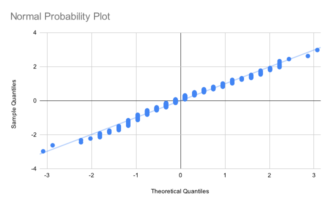
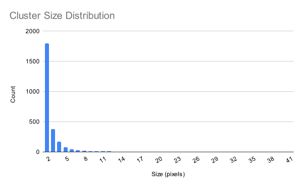
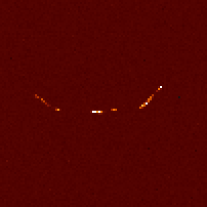
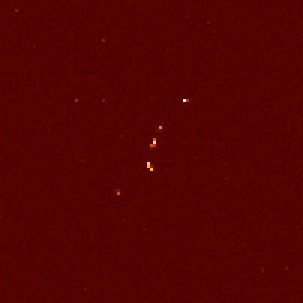
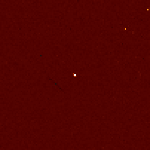
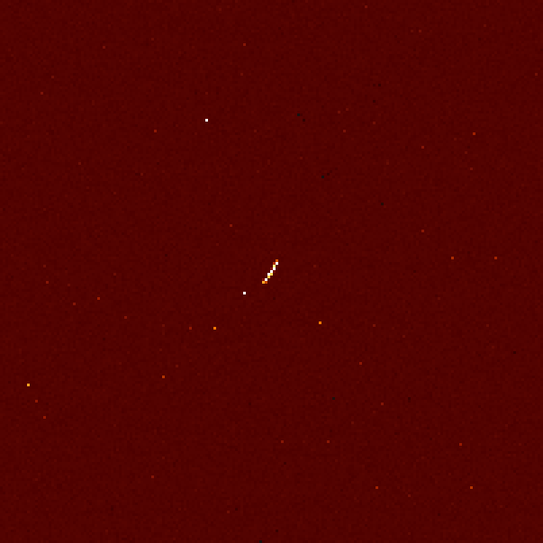

A blogpost? In this economy?! Yes, that's right. Today, we're going to be looking at how you can use an unmodified digital camera to detect cosmic rays and other charged particles.


First, what *is* a cosmic ray? They're not actually rays; rather, they are high-energy particles, usually protons, that originate from space. Some come from the Sun, while are produced by more distant sources in our galaxy or even other galaxies.

The original particle is called the primary cosmic ray, and it almost never makes it to the surface. Instead, when it collides with atoms in the atmosphere, a shower of secondary particles is produced. These particles are the ones which we'll be detecting. 

To actually observe these particles, we'll be using a plain old digital camera. This is possible because the silicon detector it uses to record the intensity of light is also sensitive to some forms of radiation! When charged particles pass through the sensor, the resulting ionization causes electrons to be ripped from the atoms within the pixels, producing charges that can be read out just like a regular image. This effect is responsible for the white speckle pattern sometimes seen in photos taken in high radiation levels.

<figure style="max-width: 500px">
    
    <figcaption>&#9835; Dumb ways to die, so many dumb ways to die... &#9835;</figcaption>
</figure>

Anyways, the procedure is very simple. Just put the lens cap on your camera, place it in a dark place with the sensor facing the zenith (straight up), and leave it to take some pictures. With a little luck, you'll be greeted by some cosmic ray tracks in your images when you come back!

A few words about camera settings:
- In theory, a shorter exposure length offers many advantages, such as increased temporal resolution and less time for dark current to accumulate. However, this comes at the cost of more data to process and more shutter wear. I settled for an exposure length of 1 minute.
- I used an ISO of 200, which corresponds to about unity gain (i.e. 1 electron equals 1 ADU) on my camera. ISO 100 would probably work well too. Read noise isn't really a concern, so a lower ISO is better since it gives us more dynamic range.

One last tidbit: my camera, a Nikon D7000, applies some transformations to raw images such as black-point subtraction and channel scaling. This is great for regular photography, but we're hardly doing regular photography here. Thankfully, there is a free [tool](https://nikonhacker.com/viewtopic.php?t=2319) that uses USB commands to disable these adjustments.

# Post-processing

I left my camera snapping away overnight, and woke up to 348 images. Let's open them up and take a look!

Upon first inspection, the images look totally black, which is hardly surprising. It's a picture taken with the lens cap on. What did you expect? 

If we crank up the exposure a lot, some patterns start to appear:


Wow, are those all cosmic rays? *No.* If you open up another exposure and go to the same spot, you will see the exact same patterns.

What we're dealing with is hot pixels. Every photosite will spontaneously produce electrons even in the absence of light due to thermal fluctuations. This signal is known as *dark current*. Most pixels produce dark current at a very low rate (about 0.1 electrons per second), but there is a small population of pixels that exhibit much higher dark current. These pixels are called hot pixels.

There isn't a robust way to distinguish a hot pixel from a cosmic ray using just one frame of data, so it's a better idea to analyze the value of a pixel across multiple frames to check for anomalies. Hot pixels will show a consistent value in every frame, while a genuine cosmic ray hit will stand out.

To start messing with our data, we must convert them to a format that our code can read, which can be accomplished using [dcraw](https://www.dechifro.org/dcraw/):

```text
dcraw -4 -D *.NEF
```

* `-4`: output linear 16-bit values
* `-D`: output a grayscale image

This converts Nikon's proprietary RAW format to [PGM](https://en.wikipedia.org/wiki/Netpbm#File_formats), which is basically an uncompressed image format with a short header. The flags are very important; dcraw is designed to work with photographic data, so it will normally perform a number of adjustments such as demosaicing and gamma correction to turn the raw data into a viewable image. But we're interested in the raw pixel values in this experiment, so we want to avoid all of those steps.

## Anomaly Detection

Now, we need to develop a way to distinguish cosmic rays from everything else in our images. We can do this using some basic statistics.

In the absence of cosmic rays, the only signal we expect to observe is the dark current, which varies randomly due to [shot noise](https://en.wikipedia.org/wiki/Shot_noise). Shot noise follows a Poisson distribution, approaching a normal distribution under our conditions.


Normality is confirmed by a normal probability plot:



(Incidentally, I totally forgot how to do these, so I wrote a short explanatory [blogpost](/blogposts/normality-plot/) to refresh my memory.)

Knowing all this, we can calculate a z-score for every sample, which essentially represents the number of standard deviations separating it from the mean. If this value is above a certain threshold, we mark the pixel in that frame as anomalous. I chose a cutoff of $z = 6$. Theoretically, the odds of observing a value that extreme due to random variation alone are well below one in a billion, but in reality there will be occasional false positives due to uncontrolled variables such as temperature (which affects dark current level).

In order to determine the z-scores, we must first compute the mean and standard deviation of each pixel. I opted for a fairly na&iuml;ve but simple approach where we compute the sample mean and sum of squared differences for each pixel in each image in two passes. There are [algorithms](https://en.wikipedia.org/wiki/Algorithms_for_calculating_variance#Welford's_online_algorithm) that can calculate both quantities simultaneously, but they're slightly more complicated, and since I only need to run the variance calculation once I did not bother with them. <s>Also, I have an SSD, so none of this is really relevant.</s>

After identifying the anomalies, I grouped them into clusters by simply finding all other anomalies within a 16-pixel radius. This worked surprisingly well, and allowed me to quickly find the most extensive cosmic ray tracks.

## Cooling

After collecting the first batch of data, I decided to do a silly little experiment. Recall that dark current is proportional to temperature. Therefore, by cooling the camera, we can significantly reduce the dark current level. I accomplished this by freezing my camera overnight.

<figure>
    
    <figcaption>Warning: not for consumption.</figcaption>
</figure>

We can see just how much cooling affects noise by comparing the distribution of pixel values. I raised the exposure time to 10 minutes while in the freezer, so the variance of the real noise level is 10x lower.


It's a pretty big reduction! Not only does the signal level go down, the distribution also becomes less dispersed, which is a product of shot noise statistics (its variance is equal to the event rate). This property can be used to determine the gain of the sensor at a given ISO; more on this in an upcoming blogpost!

<aside>

Because the cosmic rays produce such a strong signal, cooling is totally unnecessary for this experiment. It's a neat trick, though.

</aside>

# Results

At a confidence level of 6 sigma, I was left with 15,150 anomalous pixels and 2,083 clusters of at least size 2. The cosmic ray flux at sea level is about 1 muon/cm<sup>2</sup>/minute, so we should expect to have seen about 1,300 cosmic rays over the course of our experiment. This disparity can be explained by the fact that some of the particles may be of terrestrial origin (i.e. ambient radioactive decay).

Cluster size appears to follow an exponential distribution:



Graphs are nice, but I wanted to see some actual images. So, I wrote a short script that would extract each identified cluster from the image, find the difference betweeh the value of each pixel and its mean (to correct for hot pixels), and plot the result. I co-opted one of [ehtplot](https://github.com/liamedeiros/ehtplot)'s colormaps for this purpose. I also applied some gamma correction at $\gamma = 0.7$ to enhance feature visibility. 

Here is a collage of some of the nicest rays captured:


What are these particles? The curved particles ("worms") are most likely electrons; their low mass makes them easily deflected, hence the curved trajectories. These electrons are probably produced by Compton scattering of gamma rays emitted in the decay of naturally occuring radionuclides.


The straight paths are most likely muons, produced by high-altitude air showers due to cosmic rays. 


Distinguishing between the two is hardly an exact science, so... take all of this with a grain of salt.

Here are some shots from the freezer dataset:





This next one's interesting: there's a trail, but it's dark. I did a little digging and discovered the cause of this artifact: a particle track occurred at that spot  in another frame, and its influence on the mean was so significant that when we subtracted it from the pixels, the imprint of that other track was left behind.



In some frames, we see not just one track but multiple spots. It's very likely that all of these particles were produced in the same air shower, starting from one extraordinarily high-energy particle.




# Closing Remarks

I had a *lot* of fun with this project, and I'm really glad that it turned out as well as it did! 

If you're interested in replicating my experiment, my code is available on [GitHub](https://github.com/adrian154/cosmic-ray-detector). Warning: this was all written in quite a rush, so it may take some prodding to get it working. If you have any questions please feel free to reach out or leave a comment. You can also download my processed data [here](data.zip).