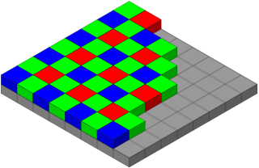

A blogpost? In this economy?! Yes, that's right. Today, we're going to be looking at how you can use an unmodified digital camera to detect cosmic rays. 

{TODO: Cosmic rays}

First, what *is* a cosmic ray? Put simply, they're not actually "rays"; rather, they are high-energy particles, usually protons, that have found their way to Earth. Some come from the Sun, while others originate from outside our Solar System or even other galaxies.

We call the original particle a primary cosmic ray, because it generally doesn't make it to the surface. Instead, when it collides with atoms in the atmosphere, a shower of secondary particles is produced. These particles are the ones which we'll be detecting. 

Speaking of which, how do we actually go about observing these particles? Well, it turns out that all you need is a plain old camera. As a charged particle flies through the silicon detector inside, electrons are ripped from the atoms of the photosites, producing charges that can be read out just like a regular image. This is also responsible for the speckles that often appear in photos of radioactive materials.

<figure style="max-width: 500px">
    
    <figcaption>&#9835; Dumb ways to die, so many dumb ways to die... &#9835;</figcaption>
</figure>

Anyways, the procedure is very simple. Just put the lens cap on your camera, put it in a dark place with the sensor facing the zenith (straight up), and leave it to take some pictures. With a little luck, you'll be greeted by some cosmic ray tracks in your images when you come back!

A few words about camera settings:
- In theory, a shorter exposure length offers many advantages, such as increased temporal resolution and less dark current. However, this comes at the cost of more data to process. I also didn't want to cause too many shutter actuations, so I settled for an exposure length of 1 minute.
- I used an ISO of 200, which corresponds to unity gain (i.e. 1 electron equals 1 ADU) on my camera. ISO 100 would probably work well too. In general, a lower ISO is preferred since read noise is not a significant concern. 

One last tidbit: my camera, a Nikon D7000, applies some transformations to raw images such as black-point subtraction and channel scaling. This is great for photographic data, but for our purposes it's highly unwanted. Thankfully, there is a free [tool](https://nikonhacker.com/viewtopic.php?t=2319) that instructs the camera to skip any of these adjustments.

As a bonus, this hack will also make the camera include the optical black pixels in the saved image. These pixels reside on the edge of the sensor and are blocked from receiving any light. Normally, they are used to calibrate the sensor's black point and are cropped from the final image, but cosmic rays can pass right through the opaque layer. Thus, we actually gain a tiny bit of extra detector area. 

# Post-processing

I left my camera snapping away overnight, and woke up to 348 images. Let's open them up and take a look!

Upon first inspection, the images look totally black, which is hardly surprising. You took a picture with the lens cap on. What did you expect? 

If we crank up the exposure a lot, some patterns start to appear:


Wow, are those all cosmic rays? *No.* If you open up another exposure and go to the same spot, you will see the exact same patterns.

What we're dealing with is hot pixels. Over time, electrons are spontaneously produced within the photosites due to thermal fluctuations, producing what is known as *dark current*. For most pixels, this is contained at about 0.1 electrons per second. However, due to flawed manufacturing, some pixels exhibit much higher dark current than others, manifesting as hot pixels.

This phenomenon means that trying to identify cosmic rays by looking at a single frame at a time will yield unreliable results. A much better strategy is to analyze the value of a single pixel across frames. Hot pixels will remain hot, whereas a genuine cosmic ray hit will stand out as an outlier.

Okay, so let's write some code to go through all our images. First, however, we must convert them to a format that we can read. My camera outputs images in Nikon's proprietary NEF format, which is not very amenable to manipulation. Luckily, there's an open-source tool called [dcraw](https://www.dechifro.org/dcraw/) which will take our NEFs and produce [PGMs](https://en.wikipedia.org/wiki/Netpbm), which are basically just a short header followed by uncompressed pixel data.

If you are replicating my experiment, here is an example dcraw invocation:

```text
dcraw -4 -D *.NEF
```

* `-4`: output linear 16-bit values
* `-D`: output a grayscale image

These flags are very important. dcraw is designed to work with photographic data, so it will normally apply some adjustments to convert the raw data into a viewable image. For example, in order to record color using silicon photodetectors that only measure brightness, every photosite in the camera sensor is covered with a colored filter in a [repeating pattern](https://en.wikipedia.org/wiki/Color_filter_array).



dcraw will assign each pixel an (R,G,B) value by interpolating based on its neighbors, a process called [demosaicing](https://en.wikipedia.org/wiki/Demosaicing). However, the particles we're looking for aren't affected by the colored filters, so demosaicing will merely distort the data and thus must be avoided.

## Anomaly Detection

Disclaimer: my statistics knowledge pretty much peaked with AP Stats and has been going downhill since. So I'm pretty much spitballing here. Beware!

In the absence of cosmic rays, the only signal we expect to observe is the dark current, which varies randomly due to [shot noise](https://en.wikipedia.org/wiki/Shot_noise). Shot noise follows a Poisson distribution, approaching a normal distribution under our conditions.


Normality is confirmed by a normal probability plot:


Incidentally, I totally forgot how to do these, so I wrote a short explanatory [blogpost](/blogposts/normality-plot/) to refresh my memory.

Knowing all this, we can calculate a z-score for every sample, which essentially represents the number of standard deviations separating it from the mean. If this value is above a certain threshold, we mark the pixel in that frame as anomalous. I chose a cutoff of $z = 5$, corresponding to a 0.0000002% chance that an anomaly is due to random variation in the dark current. In reality, due to rising sensor temperature causing increased dark current over time, the pixel values are not truly normally distributed and there will be occasional false positives.

In order to determine the z-scores, we must first compute the mean and standard deviation of each pixel. This turns out to be a bit problematic, since the na&iuml;ve algorithm requires all the values of the sample to be in memory. Unfortunately, the 11 GB of data we collected is a little too big for me to fit into memory. While there are [algorithms](https://en.wikipedia.org/wiki/Algorithms_for_calculating_variance#Welford's_online_algorithm) capable of computing mean and variance one value at a time in a single pass, I opted to calculate the sample mean and then the sum of the squared differences. This has the benefit of allowing me to remove the value in consideration from the mean and variance, preventing outliers from distorting the sample statistics.

<aside>

This is done based on the assumption that there will never be more than one outlier per pixel, which is reasonable considering that there are 17 million pixels per frame.

</aside>

The two-pass solution is slower, but by saving the computed values to a file and reusing it in subsequent analysis the computational cost is [amortized](https://en.wikipedia.org/wiki/Amortized_analysis). <s>Also, I have an SSD, so none of this is really relevant.</s>

After identifying the anomalies, I grouped them into clusters by simply finding all other anomalies within a 16-pixel radius. This worked remarkably well, and allowed me to easily find cosmic ray hits that were spread across multiple pixels.

# Results

<aside>

The raw data is available as CSV [here](anomalies.csv). The `value` column is the difference between the pixel's observed value and the mean for that pixel.

</aside>

At a confidence level of 5 sigma, I was left with 38,828 defective pixels and 2,591 clusters of at least size 2. At approximately one muon per cm<sup>2</sup> per minute, this is higher than the expected value of about 1,300 cosmic rays. This disparity can be explained by the fact that many of the particles may be of terrestrial origin (i.e. ambient radioactive decay).

Cluster size appears to follow an exponential distribution:


And without further ado... some cosmic rays!

