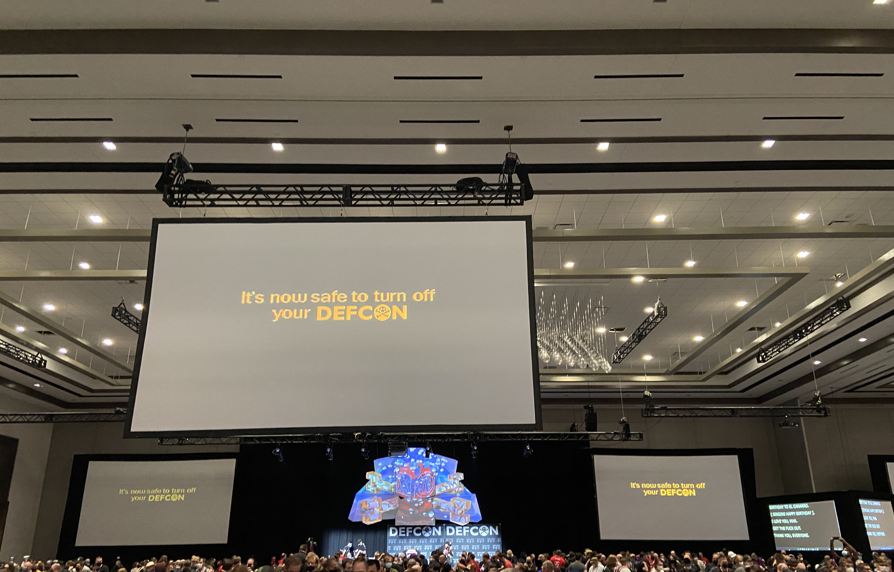

I made the decision to visit DEFCON this year with some friends, which turned out to be an absolute blast. Here are some pictures of cool stuff that we took during our time there.

<figure style="max-width: 400px">
    
    <figcaption>On our way to Vegas.</figcaption>
</figure>

<figure style="max-width: 400px">
    
    <figcaption>Awesome badge by <a href="https://twitter.com/IronwoodCyber">@IronwoodCyber</a></figcaption>
</figure>

<figure style="max-width: 400px">
    <video src="IMG_2608.mov" controls></video>
    <figcaption>Badge shenanigans.</figcaption>
</figure>

<figure style="max-width: 500px">
    
    <figcaption>Hacking in progress at the Car Hacking Village.</figcaption>
</figure>

<figure style="max-width: 500px">
    
    <figcaption>The device used by the Beverage Cooling Contest to warm up beverages for contestants.</figcaption>
</figure>

<figure style="max-width: 500px">
    
    <figcaption>Awesome setup for the Industrial Control Systems CTF.</figcaption>
</figure>

<figure style="max-width: 500px">
    
    <figcaption>Possibly the only hat that can also run SNES games.</figcaption>
</figure>

<figure style="max-width: 400px">
    
    <figcaption>A tinfoil hat at the Tinfoil Hat Contest, which would go on to win #1 in function and #2 in style.</figcaption>
</figure>

<figure style="max-width: 400px">
    
    <figcaption>...and our entry, for comparison.</figcaption>
</figure>

<figure style="max-width: 400px">
    
    <figcaption>Hackers siphoning isopropyl alcohol chilled to sub-zero temperatures for the beverage cooling contest. (Don't try this at home.)</figcaption>
</figure>

<figure style="max-width: 500px">
    
    <figcaption>Disassembled voting machine at Voting Machine Village.</figcaption>
</figure>

<figure style="max-width: 400px">
    
    <figcaption>Badge hacking at the Soldering Skills Village. Fingers were burned shortly after this image was taken.</figcaption>
</figure>

<figure style="max-width: 500px">
    
    <figcaption>Who says paper badges can't look cool?</figcaption>
</figure>

<figure style="max-width: 400px">
    
    <figcaption>Cool RGB lamp we won for placing 1st in the <a href="https://twitter.com/Mayhem_Ind">Mayhem Industries</a> CTF.</figcaption>
</figure>

<figure style="max-width: 500px">
    
    <figcaption>The end of DEFCON 30.</figcaption>
</figure>

<figure style="max-width: 500px">
    
    <figcaption>Heading home...</figcaption>
</figure>

<figure style="max-width: 500px">
    <video src="IMG_2661.mov" controls></video>
    <figcaption>...but not before one last LAN party! At 36,000 feet, no less.</figcaption>
</figure>
