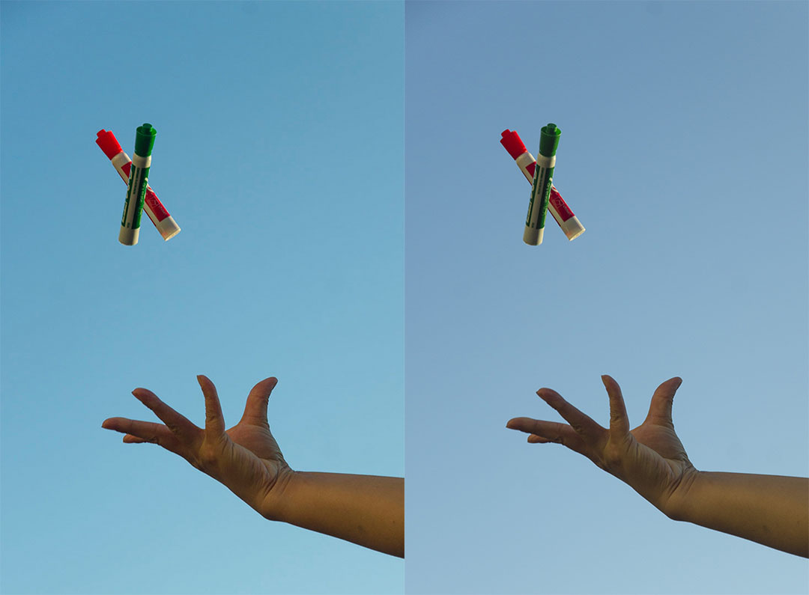

Have you ever uploaded an image to Reddit or Discord, only to find that the result is markedly desaturated compared to the original?

It's not just you. In this article, I'll be exploring the technical reason for why this happens, and how you can avoid it.

# What's going wrong?

TL;DR: it's a color space issue. It is *not* due to "compression".

Here's the scoop: every pixel in a digital image is represented as a set of numbers. How these numbers ought to be translated to actual colors is determined controlled by the *color space* of the image, so it's important that image files include information on what color space the image data represents.

Different color spaces exist for different applications. For example, most programs default to a color space called sRGB because it aligns closely with the colors that regular computer monitors are capable of displaying. However, high-end printers are often capable fo reproducing a water range of colors than sRGB can represent, so a broader color space called Adobe RGB is often preferred when working with images meant for print.

The problems arise when images with differing color spaces are improperly handled. Suppose I have this picture, which is in Adobe RGB.

This image contains colors that your monitor probably can't display. But your web browser recognizes that it needs to convert the colors to sRGB, meaning that all the colors your screen *can* display remain intact.

But when I upload the image to Discord, it ends up looking like this:

If you're having a hard time seeing the difference, here's a side-by-side comparison.

<figure style="max-width: 500px">
    
    <figcaption>Left: properly converted. Right: improperly converted.</figcaption>
</figure>

The colors have been noticeably screwed up, because Discord takes the raw values from the image, slaps them into a new container, and labels them as sRGB without ever checking if it's *actually* sRGB. It's like trying to convert a measurement from inches to centimeters by just erasing "inches" and writing in "centimeters"; the end result is going to be wrong.

## Solution

To prevent this, you need to convert your images to sRGB before uploading them to websites that don't do proper color management. This process will depend on what program you are using. In Photoshop, make sure the "Convert to sRGB" option is checked when using the Export menu, or alternatively go Edit &rarr; Convert to Profile and select sRGB for Destination Space before clicking OK and saving.