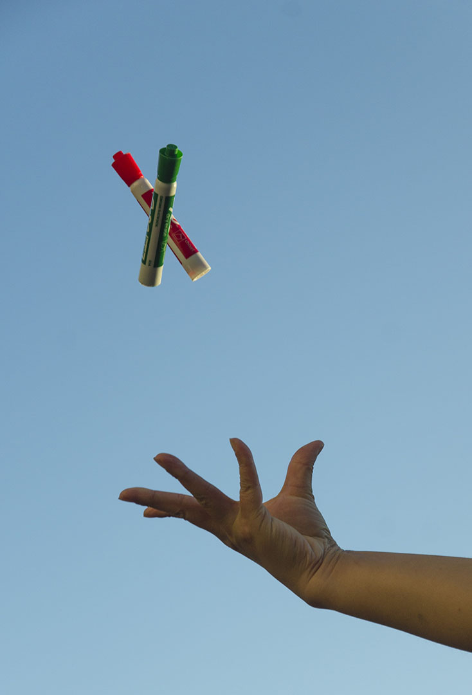

Have you ever uploaded an image to Reddit or Discord, only to find that the result is markedly desaturated compared to the original?

It's not just you. In this article, I'll be exploring the technical reason for why this happens, and how you can avoid it.

# What's going wrong?

TL;DR: it's a color space issue. It is *not* due to "compression".

A color space is a theoretical model that relates the digital values in an image and the actual colors as seen by the human eye. There are many different color spaces for different applications. Most computer screens use a color space called sRGB, because it happens to align closely with the colors that regular computer monitors are capable of displaying. However, Adobe RGB is often preferred when working with images meant for print, because high-quality printers can produce a wider range of colors than sRGB can represent. To ensure that images are displayed properly across devices, most image formats support the inclusion of metadata stating what color space the image data represents.

Most programs properly handle color space conversion, but some don't, resulting in colors being distorted in various ways. Suppose I have this picture, which is in Adobe RGB.

This image contains colors that your monitor probably can't display. But your web browser recognizes that it needs to convert the colors to sRGB, meaning that all the colors your screen *can* display remain intact.

Now when I upload the image to Discord, it ends up looking like this:

If you're having a hard time seeing the difference, here's a side-by-side comparison.

<figure style="max-width: 500px">
    
    <figcaption>Left: properly converted. Right: improperly converted.</figcaption>
</figure>

The colors have been noticeably screwed up, because Discord takes the raw values from the image, slaps them into a new container, and labels them as sRGB without ever checking if it's *actually* sRGB. It's like trying to convert a measurement from inches to centimeters by just erasing "inches" and writing in "centimeters"; the end result is going to be wrong.

## Solution

To prevent this, you need to properly convert your images to sRGB before uploading them to websites that don't properly handle color spaces. How you accomplish this will depend on what program you're using. For Photoshop CS6 (which is what I use)  you can do this by going to <kbd>Edit</kbd> &rarr; <kbd>Convert to Profile</kbd> and selecting sRGB.

# Further Reading

* [Ken Rockwell - sRGB vs Adobe RGB](https://www.kenrockwell.com/tech/adobe-rgb.htm)