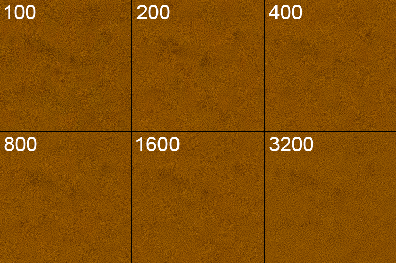

It's a common misconception that using a high ISO setting causes more noise, but this is not exactly the case. Reality is a little more complicated; keep reading to learn why.

First, to prove that high ISO does not always mean more noise, let's do a simple experiment. I'm going to use my camera (a Nikon D7000) to take a series of images of a target, changing the ISO each time but keeping everything else equal. Here are the results:

<figure style="max-width: 7720px">
    
    <figcaption>Six images of my wall, each taken at f/5.6 @ 1 s. and adjusted to the same exposure level in Photoshop. Click to expand.</figcaption>
</figure>

Look, no difference! For this reason, the D7000 is often described as ISO invariant or ISO-less. In very rough terms, this means that your choice of ISO does not really matter with respect to noise, although it will still affect your dynamic range.

This is not true of every sensor, so you might want to repeat this test using your own camera. Or, you can head over to Photons to Photos, which has a page with quantitative measurements of [input-referred read noise](https://www.photonstophotos.net/Charts/RN_e.htm) versus ISO for just about every camera under the sun. This is what the data looks like for a D7000, alongside Canon's EOS 2000D for comparison.

As you can see, the curve is fairly flat for the D7000, while the Canon produces *less* noise at higher ISOs&mdash;the exact opposite of what conventional wisdom dictates! In fact, the vast majority of cameras will exhibit one of these two patterns.

So *why* are you seeing more noise on images taken at high ISO values? In short, noise is caused primarily by insufficient light. A higher ISO cannot fix this issue; it merely brightens the image and makes the noise more visible.

Going a little deeper: under most conditions, the biggest source of noise in your image is going to be **shot noise**, which has to do with the fact that light energy is made up of individual units called photons. Because photons arrive at the sensor in a random fashion (like raindrops falling into a bucket), the number of photons detected by a pixel during the exposure will always be subject to some random deviation from the true rate of arrival, resulting in noise. Similar to how one can average many measurements to compute a more reliable estimate, the only way to mitigate shot noise is to collect more signal.

The problem is that while adjusting the aperture or shutter speed settings increases the exposure level by introducing more light, bumping up the ISO merely increases the amount of amplification applied to the signal produced by the pixels&mdash;which already contains shot noise. This becomes a problem if you're shooting on aperture or shutter priority, since a higher ISO will cause the camera to adjust the other settings to let in less light in order to maintain the same exposure level. *This* is why higher ISOs are so commonly associated noise.

# So, Wat Do?

TL;DR: don't be afraid of shooting at high ISOs! There are just two things to keep in mind:

- Make sure you are getting enough light. This can be done by setting the aperture/shutter settings appropriately on manual mode, or raising the target exposure when on shutter or aperture priority.

- Higher ISO may not mean more noise, but it does mean less dynamic range, so beware of clipping. 

Now, go forth and spread the gospel to the rest of the world&mdash;and happy photographing!