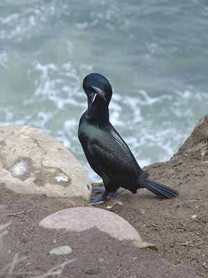
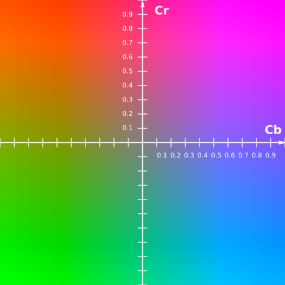
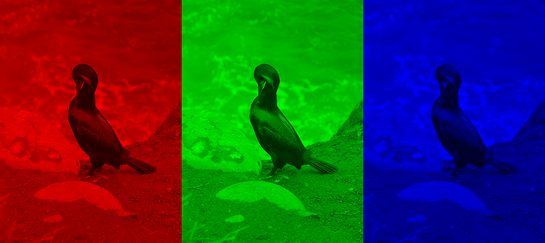
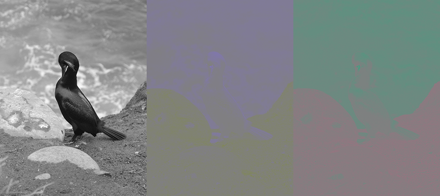
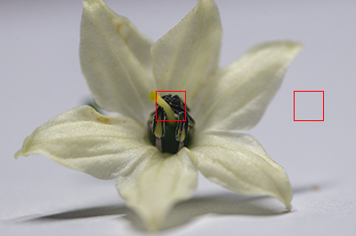
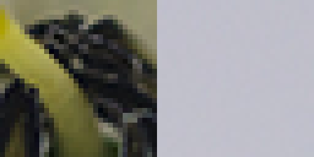
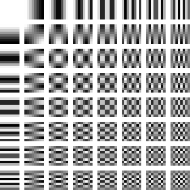
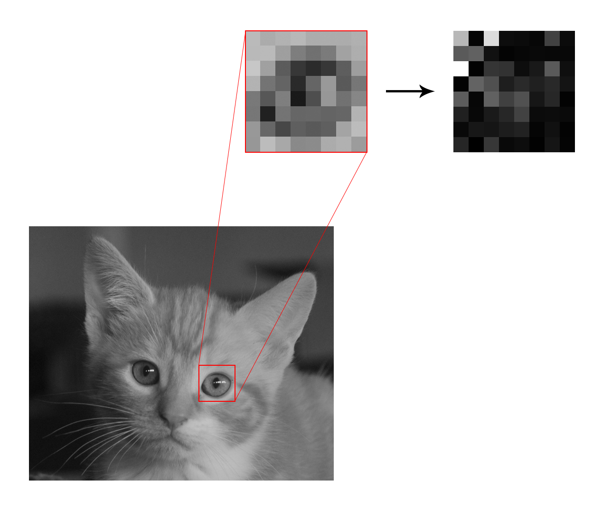
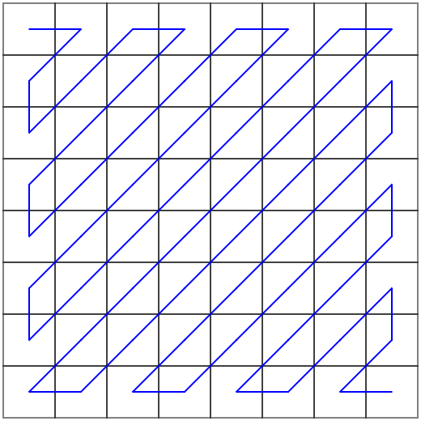

Recently, I set out to create my own photo organizer, a project which eventually bloomed into [Photobox](https://github.com/adrian154/photobox). In the process, I spent a lot of time experimenting with various image formats, which led me to an epiphany: JPEGs are ridiculously good at compressing image data, far beyond what seems possible! Take this picture, for example:

<figure style="max-width: 299px">
    
    <figcaption>This poor cormorant has no idea what he's about to go through.</figcaption>
</figure>

This image is 299 by 400 pixels. Each pixel consists of three components, red, green, and blue. The brightness of each component is encoded as an 8-bit value, so each pixel contains three bytes of information. Multiply that by the number of pixels, and we get a file size of around 350 kilobytes. Yet the image shown above is actually only 43kB in size, just 12% of the value we just calculated. In other words, by encoding the image using the JPEG format, we can achieve a compression ratio of roughly 8:1. How does JPEG accomplish this astonishing feat? Let's dive in. 

# Chroma Subsampling

The first trick that JPEG employs to remove unnecessary information is a technique called **chroma subsampling**. This step exploits the fact that our eyes are much more sensitive to changes in brightness than changes in color. After all, our eyes have about 100 million brightness-sensitive rod cells versus just 5 million color-sensitive cones. Thus, we can store the color info in the image at a lower resolution without losing too much quality.

In order to chroma subsample, we must first separate the color of a pixel from its brightness. JPEG accomplishes this by converting images to a color space called [YCbCr](https://en.wikipedia.org/wiki/YCbCr). Like RGB, YCbCr pixels also consist of three values; however, the meaning of the values are different. **Y** is the luminance (brightness) of the pixel, and **Cb** and **Cr** together represent the color of the pixel without any luminance info.

But how is RGB mapped to YCbCr? In my opinion, the relationship between the two color spaces is best explained visually. Imagine a coordinate space where the *x*, *y*, and *z* axes represented R, G, and B, respectively. This would form a cube containing all possible RGB colors.

<video class="center" loop controls autoplay><source src="rgb-cube-animation.mp4" type="video/mp4"></video>

This cube has one important property: there exists a line through the cube where the R, G, and B values are all equal. One can imagine a coordinate system where we align the cube such that the luminance component (Y) extends along this line. We can then extract a slice of the cube for any given luminance, and assign the remaining two degrees of freedom to Cb and Cr.

This is essentially how YCbCr works, except the RGB cube is slightly deformed in order to fit all the values into a range of [0, 1]. Here's a demo that shows the Cb-Cr planes as we adjust Y. 

<figure style="max-width: 480px">
    <video loop controls autoplay><source src="ycbcr-slices.mp4" type="video/mp4"></video>
    <figcaption>No, that Y is definitely not backwards.</figcaption>
</figure>

If you want a better view of what the Cb-Cr plane looks like, here is a slice of the YCbCr gamut at Y = 0.5. 

When an image is stored as JPEG, the first thing that happens is that the RGB colors are converted to YCbCr. The Cb and Cr channels are stored at half the resolution of the full image, a scheme which is referred to as **4:2:0**.

Let's compare what the components of the image look like in the two color spaces. Here's what the image looks like in RGB.

And here's what the image looks like in YCbCr:

As you can see, the importance of the luminance channel really shines through here. There is very little appreciable detail in the Cb and Cr channels, unlike in RGB space, where each channel is perceived roughly equally in the final image. We can safely discard much of the detail in the chrominance channels without sacrificing too much quality in the final image. However, this still doesn't bring us to the astounding compression ratios that JPEG achieves on a regular basis. For that, we'll need to go deeper into the compression process.

# Discrete Cosine Transform

In the previous step, we reduced size by getting rid of color information. However, we can also drastically reduce size by getting rid of unnecessary *spatial* information. What does that mean? Consider this photo of a flower.

If we zoom in close on the two highlighted regions, it becomes clear that not all image data is created equal. The region on the left contains much more detail than the one on the right, yet they are currently represented in the same number of bytes.
 

Like last time, the problem now becomes representing the image data in a way that lets us separate the important parts from the unimportant parts. JPEG accomplishes this by converting the image to the **frequency domain**.

Right now, the image exists in the spatial domain. We can think of it as a function that takes a pixel position and outputs an intensity value. However, thanks to the work of the French mathematician Joseph Fourier, we know that signals of this type can also be expressed as the sum of an infinite series of sinusoids with varying frequencies. From his insight came the concept of the Fourier transform, which converts our function from the spatial domain to the frequency domain (where it would map the frequency of each component to its amplitude). This allows us to discard the high-frequency components, which aren't as important in reconstructing the signal.

JPEG does not use the Fourier transform; instead, it uses the closely related [discrete cosine transform](https://en.wikipedia.org/wiki/Discrete_cosine_transform), whose characteristics make it better suited for use in lossy compression. Before we go further, try drawing a waveform using your mouse in the box on the left. The DCT of the signal will be taken and the signal will be reconstructed and displayed on the right.

    <canvas id="signal" width="256" height="256"></canvas>
    <canvas id="transform" width="256" height="256"></canvas>

<input type="range" min="1" id="num-cosines">

You can use the slider to change how many DCT coefficients are used to reconstruct the signal.

<aside>

If you're anything like me, the idea of breaking up a signal into sinusoidal components seems like nothing short of black magic. However, the actual implementation of DCT is surprisingly simple. We start with $N$ samples of some signal, which we'll call $x_0, x_1, \ldots x_{N-1}$. To calculate the DCT coefficient for a given frequency, we simply multiply each sample by the value of the component at the corresponding time, and add up the values. In more concrete terms, 

$$X_k = \sum_{n=0}^{N-1} x_n \cos \left[\frac{\pi}{N}\left(n + \frac12\right)k\right]$$

for $k$ in $0, 1, \ldots N-1$.

To reverse the DCT, we simply add up the components to recreate the original signal:

$$x_n = \sum_{k=0}^{N-1} X_k \cos \left[\frac{\pi}{N}\left(n + \frac12\right)k\right]$$

</aside>

Notice how removing high-frequency components from the signal affects the quality much less than the lower-frequency components. JPEG essentially does the same thing, but in 2D. The image is broken up into 8x8 blocks, which are then decomposed into a matrix of 64 coefficients.

<figure style="max-width: 312px">
    
    <figcaption>Every 8x8 block in a JPEG is expressed as a sum of these components.</figcaption>
</figure>

Note that DCT itself doesn't actually save us any bytes. We started with 64 pixels, and ended with 64 DCT coefficients.

# Quantization

Instead of simply removing all high frequency components after a certain cutoff like we did in our 1D DCT example, JPEG uses a strategy called quantization. Essentially, each DCT coefficient is divided by the corresponding value in an 8x8 *quantization table*, and then rounded down. The result is that many components of the quantized DCT coefficients will become zero, making the data more conducive for lossless compression.

Let's see how quantization works for ourselves. Say we've just performed DCT on some image data:

We now have a table of DCT coefficients.

DCT Coefficients

<table class="dct"><tr><td>-138</td><td>68</td><td>192</td><td>2</td><td>69</td><td>-24</td><td>-7</td><td>-29</td></tr><tr><td>-4</td><td>73</td><td>1</td><td>-74</td><td>5</td><td>-6</td><td>18</td><td>0</td></tr><tr><td>166</td><td>13</td><td>-40</td><td>-60</td><td>-73</td><td>20</td><td>-16</td><td>42</td></tr><tr><td>10</td><td>3</td><td>-38</td><td>-23</td><td>48</td><td>29</td><td>-22</td><td>-7</td></tr><tr><td>9</td><td>5</td><td>-10</td><td>31</td><td>-61</td><td>49</td><td>26</td><td>-10</td></tr><tr><td>-5</td><td>-7</td><td>19</td><td>24</td><td>-17</td><td>9</td><td>-4</td><td>2</td></tr><tr><td>49</td><td>-6</td><td>-68</td><td>31</td><td>30</td><td>-9</td><td>13</td><td>-16</td></tr><tr><td>9</td><td>-6</td><td>-11</td><td>15</td><td>-3</td><td>-7</td><td>-2</td><td>-3</td></tr></table>

Next, it's time to quantize. We will be using the Independent JPEG Group's recommended quantization table for this example.

IJG Quantization Table

<table class="dct"><tr><td>16</td><td>11</td><td>10</td><td>16</td><td>24</td><td>40</td><td>51</td><td>61</td></tr><tr><td>12</td><td>12</td><td>14</td><td>19</td><td>26</td><td>58</td><td>60</td><td>55</td></tr><tr><td>14</td><td>13</td><td>16</td><td>24</td><td>40</td><td>57</td><td>69</td><td>56</td></tr><tr><td>14</td><td>17</td><td>22</td><td>29</td><td>51</td><td>87</td><td>80</td><td>62</td></tr><tr><td>18</td><td>22</td><td>37</td><td>56</td><td>68</td><td>109</td><td>103</td><td>77</td></tr><tr><td>24</td><td>35</td><td>55</td><td>64</td><td>81</td><td>104</td><td>113</td><td>92</td></tr><tr><td>49</td><td>64</td><td>78</td><td>87</td><td>103</td><td>121</td><td>120</td><td>101</td></tr><tr><td>72</td><td>92</td><td>95</td><td>98</td><td>112</td><td>100</td><td>103</td><td>99</td></tr></table>

Dividing our matrix of coefficients and rounding down the results yields the following quantized values:

Quantized DCT Coefficients

<table class="dct"><tr><td>-8</td><td>6</td><td>19</td><td>0</td><td>2</td><td>0</td><td>0</td><td>0</td></tr><tr><td>0</td><td>6</td><td>0</td><td>-3</td><td>0</td><td>0</td><td>0</td><td>0</td></tr><tr><td>11</td><td>1</td><td>-2</td><td>-2</td><td>-1</td><td>0</td><td>0</td><td>0</td></tr><tr><td>0</td><td>0</td><td>-1</td><td>0</td><td>0</td><td>0</td><td>0</td><td>0</td></tr><tr><td>0</td><td>0</td><td>0</td><td>0</td><td>0</td><td>0</td><td>0</td><td>0</td></tr><tr><td>0</td><td>0</td><td>0</td><td>0</td><td>0</td><td>0</td><td>0</td><td>0</td></tr><tr><td>1</td><td>0</td><td>0</td><td>0</td><td>0</td><td>0</td><td>0</td><td>0</td></tr><tr><td>0</td><td>0</td><td>0</td><td>0</td><td>0</td><td>0</td><td>0</td><td>0</td></tr></table>

As you can see, many of the high-frequency components have become zero. This is what is accomplished by quantization; it hasn't actually reduced the size of our data yet (we still have 64 numbers), but by getting rid of unnecessary precision it has made the DCT coefficients more easily compressed by a lossless compression algorithm that will be applied next. 

<aside>

If you have ever used a program that allows you to export images as JPEG, you may have been asked to enter a quality level to save at. How does this value translate into a quantization table? The answer is that it varies between applications. 

* Photoshop has 12 proprietary quantization tables offering varying levels of compression.
* The IJG has a formula that accepts a quality factor from 0&ndash;100 and produces a table.
* Some programs are capable of calculating an optimized quantization table on-the-fly based on the image data. 

</aside>

# Lossless Compression

In the final step of JPEG compression, the DCT matrix is unraveled according to a zigzag pattern, and [Huffman coding](https://en.wikipedia.org/wiki/Huffman_coding) is applied to compress the data. How Huffman coding works is beyond the scope of this article, but if you want a concise, accessible explanation of the technique, I encourage you to check out Tom Scott's video on the subject.

<iframe width="560" height="315" src="https://www.youtube-nocookie.com/embed/JsTptu56GM8" title="YouTube video player" frameborder="0" allow="accelerometer; autoplay; clipboard-write; encrypted-media; gyroscope; picture-in-picture" allowfullscreen></iframe>

# Conclusion

If you've reached this point, congratulations; you now have a high-level understanding of the processes that take place every time you save an image as a JPEG.

There is a lot that isn't covered here; if you want to know more about the mathematics of the Fourier transform, or explore the actual implementation details of the JPEG standard, I've included some links that you can follow to continue learning about the fascinating enigma that is the JPEG format.

# Further Reading

* [ITU - T.871: JPEG File Interchange Format (JFIF)](https://www.itu.int/rec/T-REC-T.871-201105-I/en)
* [CCITT - T.81: Digital Compression and Coding of Continuous-Tone Still Images - Requirements and Guidelines](https://www.w3.org/Graphics/JPEG/itu-t81.pdf)
* [Better Explained - An Interactive Guide to the Fourier Transform](https://betterexplained.com/articles/an-interactive-guide-to-the-fourier-transform/)
* [Parametric Press - Unraveling the JPEG](https://parametric.press/issue-01/unraveling-the-jpeg/)
* [Christopher T. Jennings - How JPEG Works](https://cgjennings.ca/articles/jpeg-compression/#step-4%3A-the-quality-slider-(quantization))