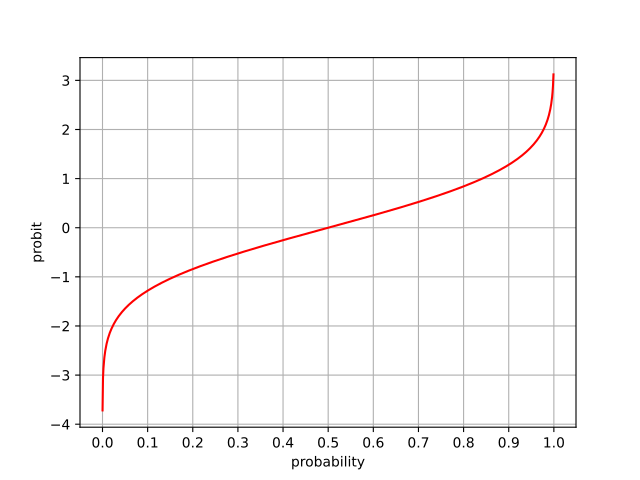
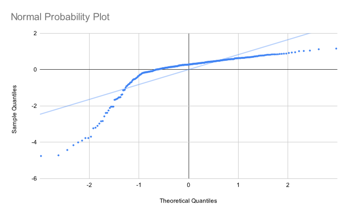
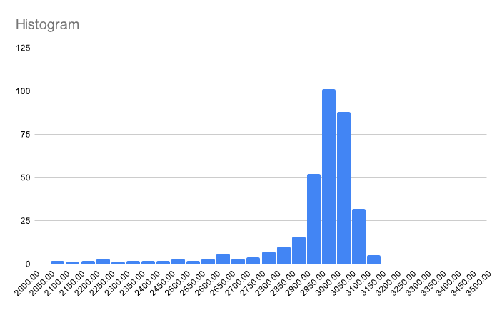
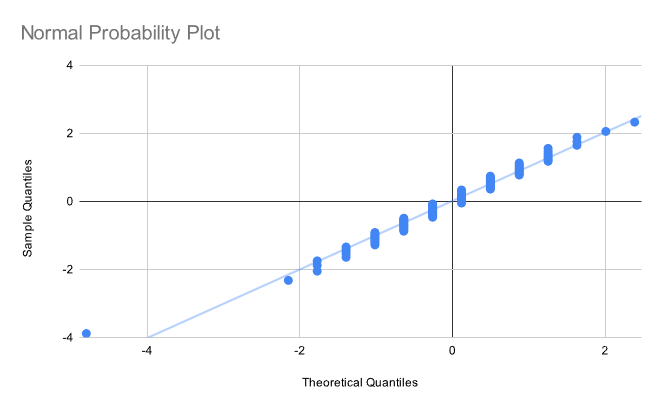
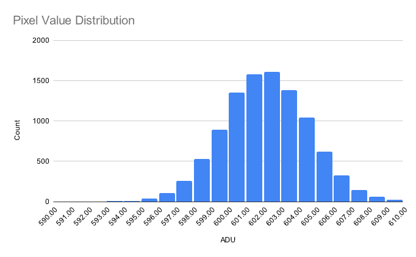

Recently, while working on a project, I had to verify that a set of data points was normally distributed. An easy, qualitative way to do this is to create a [normal probability plot](https://en.wikipedia.org/wiki/Normal_probability_plot). The only problem was that I completely forgot how to do this, and all the explanations that I could find online sucked! So, here's a dead simple primer on normal probability plots, for boneheads like me with only basic statistics knowledge.

Let's say we have some dataset. In my case, it's the value of a pixel in an image over time. We can sort the elements of the dataset in ascending order, which allows us to assign each element a rank. In addition, let's also compute the z-score of each element.

| Value | Rank | z-score |
|-------|------|---------|
| 2062  | 1    | -4.76   |
| 2069  | 2    | -4.72   |
| 2122  | 3    | -4.43   |
| 2170  | 4    | -4.16   |
| 2216  | 5    | -4.01   |
| **...** | |

Now, here's the trick. We can use some math to determine the *expected* z-score of the *n*th element. For example, we might say that the expected z-score of the 50th element in a sample of 100 normally distributed values is 0. Using this, we can create a plot of our points, where the x-axis is the expected z-score, and the y-axis is the actual z-score.

If the distribution is really normal, the resulting points will fall on a straight line. Any deviations may tell you information about the true distribution, such as its skewness.

So how do we actually compute that expected z-score I just mentioned? Well, we can start with the normal CDF, which we'll write as $\Phi(x)$. This function tells us the probability of a normally distributed random value being less than $x$.

Notice that the CDF does the exact opposite of what we want. If we're considering the *n*th value of a set, we know the probability of a normal random variable being smaller than the point we're looking at, and want to know the z-score. Therefore, we should use the *quantile function*, which is the inverse of the CDF. For this reason, we'll write it as $\Phi^{-1}(x)$.

<figure>
    
    <figcaption>The quantile function of a standard normal distribution, also known as the <a href="https://en.wikipedia.org/wiki/Probit">probit function</a>.</figcaption>
</figure>

Now let's write a formula that converts rank $n$ and dataset size $N$ to z-score $z$. We need to be careful since $\Phi^{-1}(x)$ diverges at $0$ and $1$. The following formula is used in many statistics packages:

$$z = \Phi^{-1}\left(\frac{n - \frac12}{N}\right)$$

Using this, we can assign our datapoints an expected z-score...

| Value | Rank | z-score | Expected z-score |
|-------|------|---------|------------------|
| 2062  | 1    | -4.76   | -2.97            |
| 2069  | 2    | -4.72   | -2.62            |
| 2122  | 3    | -4.43   | -2.44            |
| 2170  | 4    | -4.16   | -2.32            |
| 2216  | 5    | -4.01   | -2.23            |
| **...** | |

...and draw our normal probability plot:

*Oof.* Not very normal at all. This is corroborated by the histogram:

Let's try again, this time on a different set that is actually normally distributed. The normal probability plot:

and the histogram:

Nice! The probability plot looks a little weird due to quantization of the x-values, but this doesn't affect its functionality.

To learn more, I recommend checking out the section on the [Normal Probability Plot](https://www.itl.nist.gov/div898/handbook/eda/section3/normprpl.htm) from NIST's engineering statistics handbook.