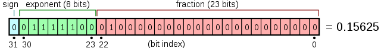

Recently, I found myself in a situation where I needed to generate a random `float` between 0 and 1 using a random 32-bit integer in C. This subject has been done to death before, but I felt like feeling a little pain so I decided to figure it out myself before using someone else's better solution.

First things first: we actually need to obtain some random integers. Easy, right? We'll just call `rand()` and&mdash;

<figure style="max-width: 512px">
    
    <figcaption>This is what will happen to you if you even suggest using C's rand().</figcaption>
</figure>

rand() is known to have [a number of problems](https://stackoverflow.com/questions/52869166/why-is-the-use-of-rand-considered-bad); here's a short list:
- If you use glibc like me, your `rand()` uses a [Linear Congruential Generator](https://en.wikipedia.org/wiki/Linear_congruential_generator). LCGs are very simple, but they are prone to subtle correlation issues that tend to manifest when applied to a multidimensional problem, such as Monte Carlo simulations.
- The number of distinct sequences that you can get from `rand()` is limited by the number of different seeds that you can provide. A quality PRNG usually has an internal state of at least 128 bits, but `srand()` only accepts an `unsigned int`, providing only 32 bits of seed material.
- `rand()` is not thread safe. Calling it will result in reads and writes to a shared location, which will cause both performance problems and randomness problems. `rand_r()` allows the user to provide a pointer that will be used to the PRNG's state, allowing thread-safe code to be written, but it is rarely used.

Okay, so `rand()` is not as *horrible* as I've made it out to be. Don't get me wrong&mdash;`rand()` is pretty crappy&mdash;but if you generated 100 random numbers and stared at it, it would probably look pretty random. So `rand()` might be okay for use cases where high quality randomness is not required (such as a game), but if you try subjecting it to [rigorous statistical tests](https://en.wikipedia.org/wiki/TestU01) it crumples like wet toilet paper.

<aside>

Aside from `rand()`'s inherent issues, common practices associated with it are often the source of additional evil. Culprits include seeding the PRNG with unsuitable values or using the modulo operator to generate random numbers within a certain range, which actually introduces bias unless your range happens to be divisible by `RAND_MAX`.

</aside>

Today, we're going to be using [xoshiro128+](https://prng.di.unimi.it/xoshiro128plus.c) as our PRNG. PCG is another viable alternative.

# Introducing Floating Point

Okay, great. So now we have a random `uint32_t`... how do we turn this into a random `float`?

The na&iuml;ve solution is to just divide the integer by the maximum value (2<sup>32</sup>), but this is not great for two reasons:
- Division is slow.
- This requires casting the integer to a float, but floats themselves are also 32 bits, so a float could not possibly represent all 32-bit integers. You can avoid this precision loss by casting to a double, but that just makes the first issue worse.

Instead, what we want to do is create a floating point number using bitwise operations. To do that, we need to familiarize ourselves with how floating point values are represented in memory; specifically, we're going to be focusing on [IEEE 754](https://en.wikipedia.org/wiki/IEEE_754), which is sort of required in the C standard.

<figure style="max-width: 640px">
    
    <figcaption>The anatomy of a single-precision float. <a href="https://en.wikipedia.org/wiki/File:Float_example.svg">Image</a> by <a href="https://en.wikipedia.org/wiki/User:Fresheneesz">Fresheneesz</a></figcaption>
</figure>

If you ever learned scientific notation in school, a floating point number is a lot like that. Basically, three fields are packed together: the sign bit, the exponent, and the integer. The function of the sign bit is very simple; 0 is positive and 1 is negative. The real value represented by a float is basically equal to $\mathrm{fraction} \times 2^\mathrm{exponent}$.

There are a few pitfalls that we need to be aware of, however:
- The exponent is stored with an offset of 127, so an exponent of 0 is equal to -127, an exponent of 127 is equal to 0, and an exponent of 255 is equal to 128. 
- The fraction section is interpreted as if there was an additional 1 bit in front of it.

In this case, the exponent portion is equal to $124 - 127 = -3$, and the fraction section is equal to $1.01_2 = 1.25$. Thus, the overall value is equal to $2^{-3} \times 1.25 = 0.15625$.

<aside>

Check out this [nifty online demo](https://www.h-schmidt.net/FloatConverter/IEEE754.html) that lets you toggle the bits in a floating point number to see how it affects the value.

</aside>

# Actually Generating Floats

Time to actually generate the floats!

We can start by drawing 23 bits from our PRNG for the fraction part. This is easy enough; we just take a 32-bit value and shift it right 9 bits. This gives us a random fraction value between $1.000\ldots_2 = 1$ and $1.111\ldots_2 \approx 2$.

If we set the exponent portion to 0, the fraction portion will be multipled with $2^0 = 1$, giving us a random number in the range $[1, 2)$. Subtracting 1 yields a number in the range $[0, 1)$.

Here's the actual code:

```c
float int_to_float(uint32_t random) {
    union { uint32_t u32; float f; } u = { .u32 = random >> 9 | 0x3f800000 };
    return u.f - 1.0;
}
```

`0x3f800000` is what we get when we take our exponent (0 is represented as 127) and shift it right 23 bits so that it's in the right place.

We could use plain old floating point multiplication instead of type punning, though there is a chance that it will be imperceptibly slower than our hacky solution. Probably not. Whatever.

You can find the full code demonstrating this concept [here](xoshiro128plus.c). That's all, folks. 