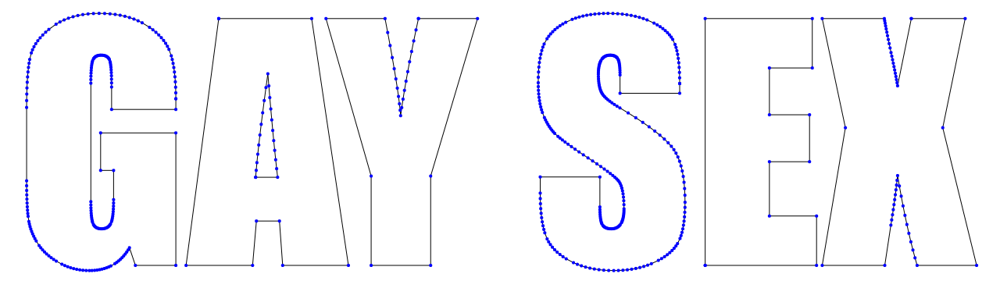
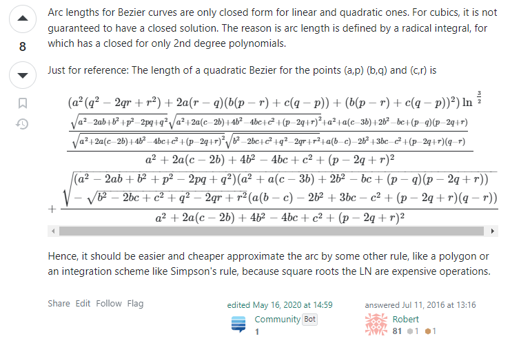
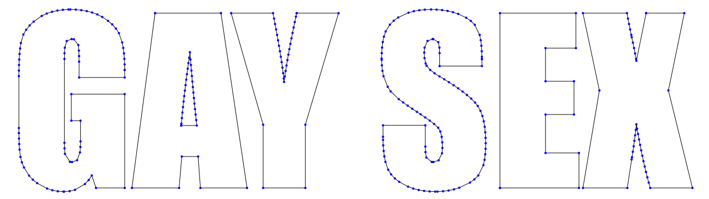
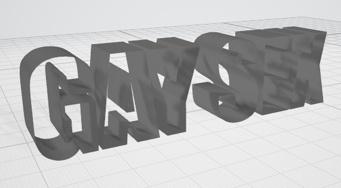
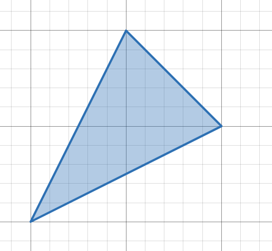
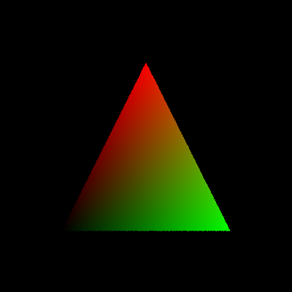

I am a big fan of 3D text reaction images. This is one of my favorites:

<figure style="max-width: 400px">
    
    <figcaption>3D render of text that reads "GAY SEX" &mdash; <a href="https://twitter.com/GlitchyPSI">@GlitchyPSI</a></figcaption>
</figure>

(My sense of humor might be a little broken.)

Anyways, I also like doing 3D graphics stuff, so I decided to recreate this meme from scratch. That means writing code to generate the model, and then creating a pathtracer to render that model using realistic lighting. Here goes!

# The Model

We will begin by building a 3D model of the scene. There are existing tools for generating meshes from text like [Text2STL](https://text2stl.mestres.fr/en-us/generator), but I opted to create my own solution so I could fine-tune the parameters to perfection.

Our first step is to convert each character into a list of points representing the outline. A good place to start is [opentype.js](https://opentype.js.org/), which takes a string and turns it into an SVG path. This frees us from decoding the font files, handling things like kerning, etc. Even *I* have limits :^)

Feeding "GAY SEX" and a copy of the Impact font file into opentype.js leaves us with a list of commands that looks like this:

```json
[
    {"type":"M","x":225.078125,"y":126.5234375},
    {"type":"L","x":225.078125,"y":140.1953125},
    {"type":"L","x":142.8515625,"y":140.1953125},
    {"type":"L","x":142.8515625,"y":111.484375},
    {"type":"Q","x1":142.8515625,"y1":84.3359375,"x":140.5078125,"y":77.5},
    {"type":"Q","x1":138.1640625,"y1":70.6640625,"x":129.375,"y":70.6640625},
    {"type":"L","x":129.375,"y":70.6640625},
    {"type":"Q","x1":121.7578125,"y1":70.6640625,"x":119.0234375,"y":76.5234375},
    {"type":"Q","x1":116.2890625,"y1":82.3828125,"x":116.2890625,"y":106.6015625},
    ...
]
```

The meaning of each command is determined by the `type` field. For Impact, we need to deal with four key commands:

- `M`: begin a new path starting at (x, y)
- `L`: draw a straight line from the previous position to (x, y)
- `Q`: draw a B&eacute;zier curve to (x, y) with a control point at (x1, y1)
- `Z`: close the path

Most of these commands are pretty trivial, except for `Q`. I didn't really know how B&eacute;zier curves worked, so I replaced them with straight lines on my initial attempt. Here's what the result looks like:


Not *terrible*, but it's rather jagged. Let's fix this.

A quadratic B&eacute;zier curve, simply put, is a way of defining a smooth curve in terms of two anchor points and a control point. They work by tracing a point on an imaginary line that spans between the lines connecting the two anchor points to the control point. Frankly, it's a rather tricky concept to put into words, so here's an interactive widget that demonstrates the principle.

<canvas id="bezier-demo" style="width: 100%"></canvas>
<input type="range" id="bezier-t" style="width: 100%" min="0" max="100" step="1">  

Mathematically, a B&eacute;zier curve is a parametric function, mapping a scalar input $t$ to 2D points along a path. We can obtain the point for a given $t$ value by first determining the coordinates of the points defining the blue line (obtained by linearly interpolating along the lines between the anchor points and the control points), and then linearly interpolating between those two points to get the point on the curve. Here is a rather crude implementation in JavaScript:

```js
// linearly interpolate between points A and B for t in the range [0, 1]
const lerp2 = (A, B, t) => [
    A[0] + (B[0] - A[0]) * t,
    A[1] + (B[1] - A[1]) * t
];

const quadBezier = (A0, A1, C, t) => lerp2(lerp2(A0, C, t), lerp2(C, A1, t), t);
```

We can apply this to our opentype.js output by evaluating `quadCurve` at regular intervals of $t$ for every quadratic curve in the path, which yields the following discretization:



The lines are smooth now, but the points are distributed unevenly. For example, look at the inner curves of the S. There are *way* too many points in those areas, much more than what's necessary to create the illusion of a smooth, continuous curve. These excess points will increase the complexity of our model and slow down our renderer. If we increase the sampling interval to bring down the number of points, we end up with too few points on the larger curve segments. 

The problem is that the relationship between $t$ and the length of the curve up to $t$, which we'll call $s$, is not linear. We want our samples to be evenly distributed along $s$, so we need a function mapping $s$ to $t$. For quadratic B&eacute;zier curves, a closed-form expression for arc length *does* exist, but it's rather&hellip; unwieldy:

<figure>
    
    <figcaption><a href="https://gamedev.stackexchange.com/a/6019/98873">@robert - Bezier curve arc length</a></figcaption>
</figure>

Luckily, there's an easier way. We can approximate the arc length function by evaluating the curve at regular intervals of $t$, recording the total length of the segments up to that point, and inverting the function. The code looks something like this:

```js
const tToArclen = new Array(32);
let totalLen = 0, prevPoint = anchor0;
tToArclen[0] = 0;
for(let i = 1; i < tToArclen.length; i++) {
    const sample = quadBezier(anchor0, anchor1, controlPoint, i / (tToArclen.length - 1));
    totalLen += Math.sqrt(squareDist(sample, prevPoint));
    tToArclen[i] = totalLen;
    prevPoint = sample;
}

const arclenToT = arclen => {
    let i = 0;
    while(tToArclen[i] < arclen) {
        i++;
    }
    return (arclen - tToArclen[i -  1]) / ((tToArclen[i] - tToArclen[i - 1]) * (tToArclen.length - 1)) + (i - 1) / tToArclen.length;
};
```

In `arclenToT`, we simply use linear interpolation to find the approximate value of $t$ that lies at an arc length of `dist` on the curve. Armed with `distToT`, we can sample the curve at even intervals of arc length rather than $t$. Here's what the output looks like after we apply this technique:



Much better.

The next step is to convert our 2D outlines into a 3D model. The preferred representation for 3D objects in computer graphics is a *polygon mesh*, which is just a thin surface defined by a collection of polygons (usually triangles). Our mesh will consist of a list of 3D points, following by a list of triangles (where each triangle is a 3-tuple of indices into the points list). Since most vertices are shared between several triangles, this considerably reduces our memory usage. 

Building the side walls of our text is pretty simple. We basically extrude our outlines into 3D surfaces by copying the points, shifting them to however thick we want our text to be, then connecting them to the front points with triangles. 

<figure>
    
    <figcaption>I wrote a quick <a href="https://en.wikipedia.org/wiki/Wavefront_.obj_file">OBJ</a> exporter so I could preview the results in Windows' 3D viewer, but we won't be using that format in our actual renderer.</figcaption>
</figure>

Now we need to fill in the front and back of our 3D text, meaning that we must triangulate each letter. This is actually kind of tricky, especially since some letters like A have holes in them. Thankfully, I came across a [blogpost](https://alienryderflex.com/polygon_triangulation_with_hole.shtml) by Darel Rex Finley that outlined a robust algorithm in a very understandable manner. If you are working on the same problem I cannot recommend his blogpost enough, but here's the gist of it:

In order to triangulate a polygon, we crawl around the edge looking for a suitable triangle. When one is found, we create the triangle remove its vertices from the working set of points, and start over until all the points are accounted for. This is known as the [ear-clipping method](https://en.wikipedia.org/wiki/Polygon_triangulation#Ear_clipping_method).

<video class="center" loop muted autoplay playsinline><source src="triangulate-c.mp4" type="video/mp4"></video>

How do we deal with holes? Well, it turns out that as long as the path is not self-intersecting, it's totally fine if there are some shared sides. Of course, due to the limitations of floating-point arithmetic, some fine tuning is necessary to get things working. Watch it at work:

<video class="center" loop muted autoplay playsinline><source src="triangulate-a.mp4" type="video/mp4"></video>

Once we've triangulated the front faces of the text, all that remains is for us to combine everything into one model and export it. This leaves us with the product of our efforts so far:


That's some solid progress, if you ask me!

# The Renderer

We've got the model&mdash;now, it's time to bring it to life. We will accomplish this through raytracing. The idea is that for each pixel, we shoot a ray into scene originating from the camera position and through the image plane. We then perform some calculations to determine the first surface hit by the ray, and then shoot out more rays from the hit point towards the light sources to figure out the shading.

Coding the renderer involves a lot of boilerplate, which I won't cover here. If you are interested in the implementation details, I recommend checking out Peter Shirley's [Ray Tracing In One Weekend](https://raytracing.github.io/books/RayTracingInOneWeekend.html).

## Tracing Rays

For now, let's focus on the geometric aspect of the problem: figuring out where the ray intersects our mesh (if at all). Our mesh is nothing more than a list of triangles, so the problem boils down to ray-triangle intersection.

First, let's define all the inputs we're working with. We have a ray, which starts at a point $O$ and extends along direction $D$ infinitely. Therefore, we can express every point along the ray in terms of the equation $O + tD$, where $t \geq 0$. In addition, we have a triangle with vertices $A$, $B$, and $C$. 

Our triangle is flat, meaning that it is contained within an infinite plane. The only case where our ray doesn't intersect with this plane is if it's parallel to it. We can check if our ray is parallel to triangle by computing the dot product of the ray's direction and the normal vector of the plane. If it's zero, we know that the ray does not intersect with the plane and thus cannot intersect with the triangle.

```c
Vec3 edge1 = sub(vertex1, vertex0);
Vec3 edge2 = sub(vertex2, vertex0);
float det = dot(ray->direction, cross(edge1, edge2));

if(det > -EPSILON && det < EPSILON) {
    return null;
}
```

(Instead of directly comparing with `0.0`, we check if `det` is in the range of (-epsilon,epsilon), where epsilon is a small fudge factor. This accounts for the limited precision of floating-point math.)

If our ray *does* intersect with the plane, then we can effectively reduce this problem to 2D, since everything is now contained within the plane. We just need to check if the hit point is contained within the triangle.

Consider a triangle with vertices at $(0, 0)$, $(1, 0)$, and $(0, 1)$.


Let's look at the two edges originating from the origin. We'll call them $e_1 = (1, 0)$ and $e_2 = (0, 1)$. Any point in the triangle, and indeed any point in the plane, can be described as a linear combination of these two vectors:

$$P = ue_1 + ve_2$$

Essentially, what we have done is create a new coordinate system, one which has a very important characteristic: for all the points within our triangle, $u + v \leq 1$.

For the example triangle I showed above, this isn't super interesting since the resulting coordinate system is the exact same as the regular Cartesian plane. But with a tad more math, we can do this with any triangle we want!

Let's look at a fancier triangle, with vertices at $(1,1)$, $(2,3)$, and $(3,2)$.



First, we need to pick a point to be our origin. Any point will work, so let's go with $(1,1)$. Then, the two edges which will serve as our basis vectors are $e_1 = (1,2)$ and $e_2 = (2,1)$.


All that we've really done is stretch the coordinate space so that the first triangle becomes the second. (If I were better at Desmos I would animate this, but I don't know how, so you'll just have to imagine). But since this transformation is linear, pretty much all the properties of the original space are preserved.

By now, you might have a sense of where this is going. To check if the intersection point is contained within the triangle, all we have to do is compute the point's coordinates in our skewed system and check if $u + v \leq 1$.

So, let us put these concepts to practice. We have a triangle defined by vectors $A, B, C$. Let's pick $A$ to act as the origin, so our two edges are given by $e_1 = B-A$ and $e_2 = C-A$. Similarly, the point where our ray intersects with the plane is given by $(O-A) + tD$ (we subtract $A$ from $O$ to reflect the fact that $A$ is the origin of our new coordinate system). So, the problem becomes how to determine $t$, $u$, and $v$ so that

$$(O-A) + tD = ue_1 + ve_2$$

or

$$-tD + ue_1 + ve_2 = (O-A)$$

This one equation is actually three separate equations in disguise, since we're dealing with 3-component vectors. Because there are three equations for our three unknowns, then we may be able to find a unique solution. We can represent this as a matrix multiplication:

$$
\begin{bmatrix}
    -D & e_1 & e_2
\end{bmatrix}
\begin{bmatrix}
    t \\
    u \\
    v
\end{bmatrix}
= (O-A)
$$

(Since $D$, $e_1$, and $e_2$ are 3-component vectors, the leftmost matrix is 3&times;3 and not 1&times;3.)

To solve for the unknowns, we can use [Cramer's rule](https://en.wikipedia.org/wiki/Cramer%27s_rule). Cramer's rule says that for a matrix equation of the form $Ax = b$, the $i$th component of $x$ is given by

$$x_i = \frac{\det A_i}{\det A}$$

where $A_i$ is matrix $A$, except column $i$ is replaced with $b$.

If this doesn't make any sense to you, that's OK; we can use it without fully understanding it. If you are interested in why it works, check out this [MathWorld article](https://mathworld.wolfram.com/CramersRule.html).

Applying Cramer's rule to our equation, we can solve for our unknowns:

$$t = \frac{\det \begin{bmatrix}(O-A) & e_1 & e_2\end{bmatrix}}{\det \begin{bmatrix}-D & e_1 & e_2\end{bmatrix}}$$

$$u = \frac{\det \begin{bmatrix}-D & (O-A) & e_2\end{bmatrix}}{\det \begin{bmatrix}-D & e_1 & e_2\end{bmatrix}}$$

$$v = \frac{\det \begin{bmatrix}-D & e_1 & (O-A)\end{bmatrix}}{\det \begin{bmatrix}-D & e_1 & e_2\end{bmatrix}}$$

Helpfully, the determinant of matrix $\begin{bmatrix}a & b & c\end{bmatrix}$ is equal to its [triple product](https://en.wikipedia.org/wiki/Triple_product), or $a \cdot (b \times c)$. In fact, we've already computed the value of $D \cdot (e_1 \times e_2)$ to determine if the ray is parallel to the plane!

Putting it all into code:

```c
void raytraceTriangle(const Vec3 *A, const Vec3 *B, const Vec3 *C, const Ray *ray, Hit *hit) {

    // compute edges
    Vec3 edge1 = (Vec3) {B->x - A->x, B->y - A->y, B->z - A->z};
    Vec3 edge2 = (Vec3) {C->x - A->x, C->y - A->y, C->z - A->z};

    // check if the ray is parallel to the triangle
    Vec3 normal = cross(edge1, edge2);
    float det = dot(ray->direction, normal);
    if(det > -EPSILON && det < EPSILON) {
        hit->hit = false;
        return;
    } 

    // compute coordinates u and v via Cramer's rule; u + v <= 1
    float invDet = -1 / det;
    Vec3 origin = sub(ray->origin, *A);
    float u = -dot(ray->direction, cross(origin, edge2)) * invDet;
    if(u < 0 || u > 1) {
        hit->hit = false;
        return;
    }

    float v = -dot(ray->direction, cross(edge1, origin)) * invDet;
    if(v < 0 || u + v > 1) {
        hit->hit = false;
        return;
    }

    // compute where the intersection is
    float t = dot(origin, normal) * invDet;
    
    // if t is negative, the intersection point is behind the origin 
    if(t < EPSILON) {
        hit->hit = false;
        return;
    }

    hit->hit = true;
    hit->point = getRayPoint(ray, t);
    hit->normal = normalize(normal);
    hit->distance = t;
    hit->u = u;
    hit->v = v;


}
```

If we combine this with some code that iterates over the pixels of the image, generates a camera ray for each pixel, and calls our code to test for an intersection, we get:



We've just raytraced our first triangle using the [M&ouml;ller-Trumbore](https://en.wikipedia.org/wiki/M%C3%B6ller%E2%80%93Trumbore_intersection_algorithm) algorithm. I've gone ahead and shaded the pixels according to the U/V values, to add a little color.

To render our model, we just need to loop through each triangle, test for an intersection, and return the closest intersection for each pixel, yielding a magnificent result:


Here, the color of each pixel is simply determined by treating the normal vector at each hit point as an RGB triplet (with a bit of rescaling).

You might notice that the edges of our model are quite rough; this is due to [aliasing](https://en.wikipedia.org/wiki/Aliasing). We'll fix this later. For now, we have a bigger problem: we test every ray against every triangle in the model, meaning that our efficiency is pretty bad! That last render alone involved 56,524,800 ray-triangle intersection tests.

This isn't a big deal right now, since we're only tracing one ray per pixel, but once we introduce physically based rendering our render times will become painfully long. So, let's fix this.

## Acceleration Structure

How do we check if a ray intersects with the mesh without testing it against every triangle? One solution is to find a shape that contains the entire mesh (a [bounding volume](https://en.wikipedia.org/wiki/Bounding_volume)), and check if the ray intersects with it. If the ray does not intersect with the bounding volume, we can immediately return a miss, saving us a great deal of computational expense. 

You could use any shape as a bounding volume, but an excellent choice is the **axis-aligned bounding box (AABB)**. An AABB is just a box whose planes are aligned to the axes of the coordinate system. These properties mean that an AABB can be defined using just two points, and intersection testing is efficient too.

I won't explain the algorithm in full detail here; for that, I recommend checking out [Tavian's blogpost](https://tavianator.com/2011/ray_box.html). Basically, the idea is that we can treat the sides of the box as belonging to three pairs of parallel planes. Computing the intersection distance to any of these planes consists of solving a linear equation of one variable. 

We can imagine the pairs of intersection distances as line segments on the ray. If the ray intersects with the box, there will be some location where all three segments overlap. We can check this with minimal branching using clever application of `fmin` and `fmax`.

```c
bool raytraceBox(const Box *box, const Ray *ray) {
    
    // find intersection distance with X-planes
    float tx1 = (box->min.x - ray->origin.x) / ray->direction.x,
          tx2 = (box->max.x - ray->origin.x) / ray->direction.x;

    // determine which intersection point was closer or further
    float tmin = fmin(tx1, tx2),
          tmax = fmax(tx1, tx2);

    float ty1 = (box->min.y - ray->origin.y) / ray->direction.y,
          ty2 = (box->max.y - ray->origin.y) / ray->direction.y;

    // clip intersecting segment using new values
    tmin = fmax(tmin, fmin(ty1, ty2));
    tmax = fmin(tmax, fmax(ty1, ty2));

    float tz1 = (box->min.z - ray->origin.z) / ray->direction.z,
          tz2 = (box->max.z - ray->origin.z) / ray->direction.z;

    tmin = fmax(tmin, fmin(tz1, tz2));
    tmax = fmin(tmax, fmax(tz1, tz2));

    // if an unclipped segment remains, the ray intersects
    return tmax >= tmin;

}
```

Now, we can pre-compute the bounding box of our mesh, and test rays against it before launching into our old ray-mesh code.

1L BVH: 

33,328,000 91824

## Light Transport

<script src="bezier.js"></script>