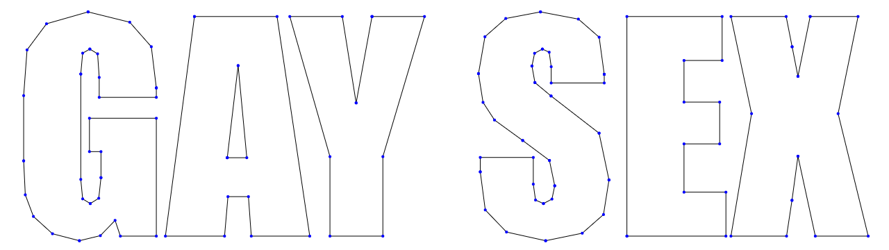
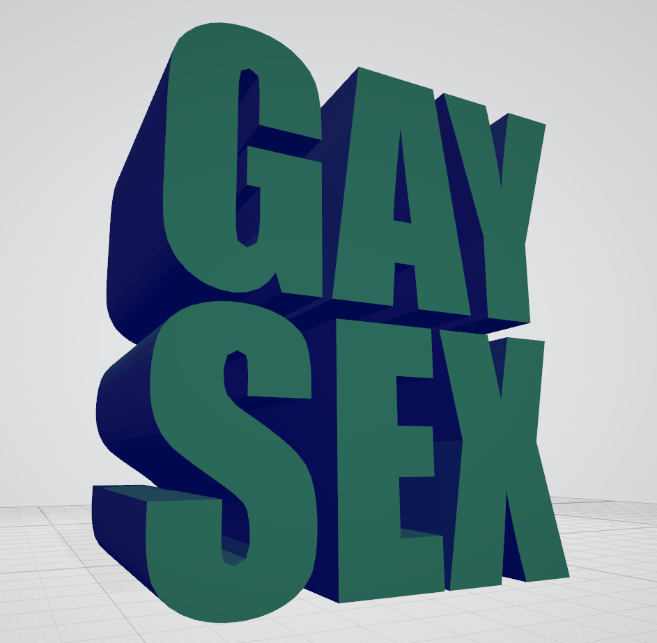

I am a big fan of 3D text reaction images. This is one of my favorites:

<figure style="max-width: 400px">
    
    <figcaption>3D render of text that reads "GAY SEX" &mdash; <a href="https://twitter.com/GlitchyPSI">@GlitchyPSI</a></figcaption>
</figure>

(My sense of humor might be a little broken.)

Anyways, I also like doing 3D graphics stuff, so I decided to recreate this meme from scratch. That means writing code to generate the model, and then creating a pathtracer to render that model using realistic lighting. Here goes!

# The Model

We will begin by building a 3D model of the scene. There are existing tools for generating meshes from text like [Text2STL](https://text2stl.mestres.fr/en-us/generator), but I opted to create my own solution so I could fine-tune the parameters to perfection.

Our first step is to convert each character into a list of points representing the outline. A good place to start is [opentype.js](https://opentype.js.org/), which takes a string and turns it into an SVG path. This frees us from decoding the font files, handling things like kerning, etc. Even *I* have limits :^)

Feeding "GAY SEX" and a copy of the Impact font file into opentype.js leaves us with a list of commands that looks like this:

```json
[
    {"type":"M","x":225.078125,"y":126.5234375},
    {"type":"L","x":225.078125,"y":140.1953125},
    {"type":"L","x":142.8515625,"y":140.1953125},
    {"type":"L","x":142.8515625,"y":111.484375},
    {"type":"Q","x1":142.8515625,"y1":84.3359375,"x":140.5078125,"y":77.5},
    {"type":"Q","x1":138.1640625,"y1":70.6640625,"x":129.375,"y":70.6640625},
    {"type":"L","x":129.375,"y":70.6640625},
    {"type":"Q","x1":121.7578125,"y1":70.6640625,"x":119.0234375,"y":76.5234375},
    {"type":"Q","x1":116.2890625,"y1":82.3828125,"x":116.2890625,"y":106.6015625},
    ...
]
```

The meaning of each command is determined by the `type` field. For Impact, we need to deal with four key commands:

- `M`: begin a new path starting at (x, y)
- `L`: draw a straight line from the previous position to (x, y)
- `Q`: draw a B&eacute;zier curve to (x, y) with a control point at (x1, y1)
- `Z`: close the path

Most of these commands are pretty trivial, except for `Q`. I didn't really know how B&eacute;zier curves worked, so I replaced them with straight lines on my initial attempt. Here's what the result looks like:



Not *terrible*, but it's rather jagged. Let's fix this.

A quadratic B&eacute;zier curve, simply put, is a way of defining a smooth curve in terms of two anchor points and a control point. They work by tracing a point on an imaginary line that spans between the lines connecting the two anchor points to the control point. Frankly, it's a rather tricky concept to put into words, so here's an interactive widget that demonstrates the principle.

<canvas id="bezier-demo" style="width: 100%"></canvas>
<input type="range" id="bezier-t" style="width: 100%" min="0" max="100" step="1">  

Mathematically, a B&eacute;zier curve is a parametric function, mapping a scalar input we call $t$ to 2D points along a path. We can obtain the point for a given $t$ value by first determining the coordinates of the points defining the blue line (obtained by linearly interpolating along the lines between the anchor points and the control points), and then linearly interpolating between those two points to get the point on the curve. Here is a rather crude implementation in JavaScript:

```js
// linearly interpolate between points A and B for t in the range [0, 1]
const lerp2 = (A, B, t) => [
    A[0] + (B[0] - A[0]) * t,
    A[1] + (B[1] - A[1]) * t
];

const quadBezier = (A0, A1, C, t) => lerp2(lerp2(A0, C, t), lerp2(C, A1, t), t);
```

We can apply this to our opentype.js output by evaluating `quadCurve` at regular intervals of $t$ for every quadratic curve in the path, which yields the following discretization:


The lines are smooth now, but the points are distributed unevenly. For example, look at the inner curves of the S. There are *way* too many points in those areas, much more than what's necessary to create the illusion of a smooth, continuous curve. These excess points will increase the complexity of our model and slow down our renderer. If we increase the sampling interval to bring down the number of points, we end up with too few points on the larger curve segments. 

The problem is that the relationship between $t$ and the length of the curve up to $t$, which we call $s$, is not linear. We want our samples to be evenly distributed along $s$, so we need a function mapping $s$ to $t$. For quadratic B&eacute;zier curves, a closed-form expression for arc length *does* exist, but it's rather&hellip; unwieldy:

<figure>
    
    <figcaption><a href="https://gamedev.stackexchange.com/a/6019/98873">@robert - Bezier curve arc length</a></figcaption>
</figure>

Luckily, there's an easier way. We can approximate the arc length function by evaluating the curve at regular intervals of $t$, recording the total length of the segments up to that point, and inverting the function. The code looks something like this:

```js
const tToArclen = new Array(32);
let totalLen = 0, prevPoint = anchor0;
tToArclen[0] = 0;
for(let i = 1; i < tToArclen.length; i++) {
    const sample = quadBezier(anchor0, anchor1, controlPoint, i / (tToArclen.length - 1));
    totalLen += Math.sqrt(squareDist(sample, prevPoint));
    tToArclen[i] = totalLen;
    prevPoint = sample;
}

const arclenToT = arclen => {
    let i = 0;
    while(tToArclen[i] < arclen) {
        i++;
    }
    return (arclen - tToArclen[i -  1]) / ((tToArclen[i] - tToArclen[i - 1]) * (tToArclen.length - 1)) + (i - 1) / tToArclen.length;
};
```

In `arclenToT`, we simply use linear interpolation to find the approximate value of $t$ that lies at an arc length of `dist` on the curve. Armed with `distToT`, we can sample the curve at even intervals of arc length rather than $t$. Here's what the output looks like after we apply this technique:


Much better.

The next step is to convert our 2D outlines into a 3D model. The preferred representation for 3D objects in computer graphics is a *polygon mesh*, which is just a thin surface defined by a collection of polygons (usually triangles). We will be storing our mesh as an array of 3D points, followed by a list of triangles whose vertices are provided as indices into the array  of points. This allows us to take advantage of the fact that the same vertex is usually shared by multiple triangles to reduce memory usage.

Building the side walls of our text is pretty simple. We basically extrude our outlines into 3D surfaces by copying the points, shifting them to however thick we want our text to be, then connecting them to the front points with triangles. 

<figure>
    
    <figcaption>I wrote a quick <a href="https://en.wikipedia.org/wiki/Wavefront_.obj_file">OBJ</a> exporter so I could preview the results in Windows' 3D viewer, but we won't be using that format in our actual renderer.</figcaption>
</figure>

Now we need to fill in the front and back of our 3D text, meaning that we must triangulate each letter. This is actually kind of tricky, especially since some letters like A have holes in them. Thankfully, I came across a [blogpost](https://alienryderflex.com/polygon_triangulation_with_hole.shtml) by Darel Rex Finley that outlined a robust algorithm in a very understandable manner. If you are working on the same problem I cannot recommend his blogpost enough, but here's the gist of it:

In order to triangulate a polygon, we crawl around the edge looking for a suitable triangle. When one is found, we remove it from the working set of points and start over until all the points are accounted for. This is known as the [ear-clipping method](https://en.wikipedia.org/wiki/Polygon_triangulation#Ear_clipping_method).

<video class="center" loop muted autoplay><source src="triangulate-c.mp4" type="video/mp4"></video>

How do we deal with holes? Well, it turns out that as long as the path is not self-intersecting, it's totally fine if there are some shared sides. Of course, due to the limitations of floating-point arithmetic, some fine tuning is necessary to get things working. Watch it at work:

<video class="center" loop muted autoplay><source src="triangulate-a.mp4" type="video/mp4"></video>

Once we've triangulated the front faces of the text, all that remains is for us to combine everything into one model and export it. This leaves us with the product of our efforts so far:



Beautiful.

# The Renderer

We've got the model&mdash;now, it's time to bring it to life.

<script src="bezier.js"></script>