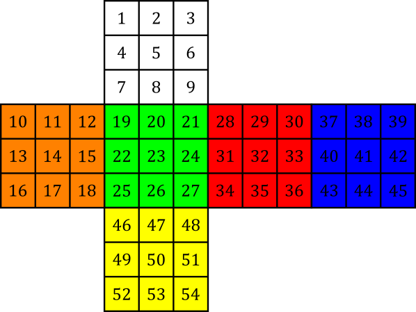
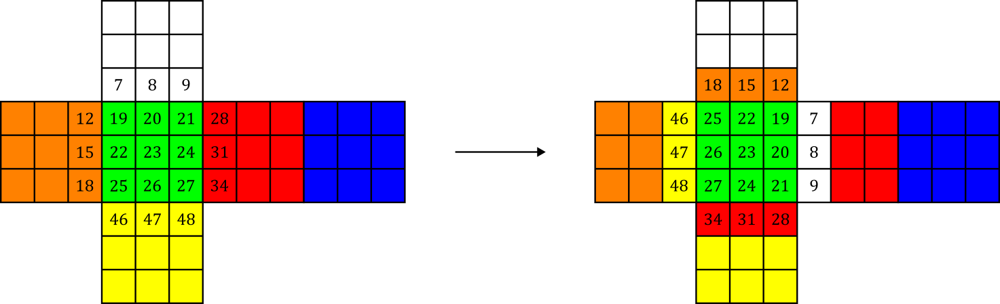

Anyone who knows how to solve a Rubik's cube can tell you that even though the puzzle may seem impossibly difficult at first, with just a little bit of practice and memorization, just about anyone can solve it&mdash;[including you](https://www.youtube.com/watch?v=7Ron6MN45LY)! No. Today, we are gathered to tackle an even more formidable challenge: solving Rubik's cube in the *fewest moves possible*.

You see, when a human solves the cube, they are not doing so in a move-optimal manner. The trouble is that solving one part of the cube will invariably alter other parts in unpredictable ways. To circumvent this, methods designed for humans like [CFOP](https://www.speedsolving.com/wiki/index.php?title=CFOP_method) and [Roux](https://www.speedsolving.com/wiki/index.php?title=Roux_method) make judicious use of "algorithms": memorized sequence sof moves that operate on specific pieces while leaving the rest of the cube untouched. For example, CFOP starts by solving the first two layers of the cube; because the top layer is available for moving pieces around, algorithms are not necessary in this step. To fix the top layer, cubers use one of 57 algorithms to orient the remaining pieces, followed by one of 21 algorithms to permute the pieces and complete the solve. Other methods like Roux differ in the exact details, but they more or less follow the same general blueprint. 

Using this approach, humans have managed to pull off some [truly extraordinary feats](https://www.youtube.com/watch?v=gh8HX4itF_w). But ultimately, we are limited by the capabilities of our meaty brains. One longs to witness what level of perfection can be attained by applying the cold, unflinching mind of a computer to the same problem.

Well, unfortunately a computer is only as effective as its programmer, which does not really bode well when I'm at the helm. But we can still learn a great deal of interesting things regarding the inner workings of the Rubik's cube, so let's give it a go anyways!

# Cube Representation

Let us start by labeling each tile of the cube with a number 1&ndash;54. Then, any state of the cube can be represented as a permutation of length 54. This scheme would be quite a bad choice for a solving program since it wastes a lot of space on states that can never exist on a real cube, but it is useful for understanding the properties of the puzzle.

<figure style="max-width: 598px">
    
    <figcaption>An example of how one might number the tiles of a Rubik's cube</figcaption>
</figure>

Let's examine what happens when we turn the cube:

