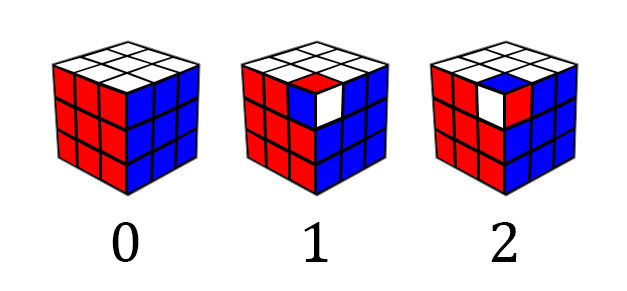
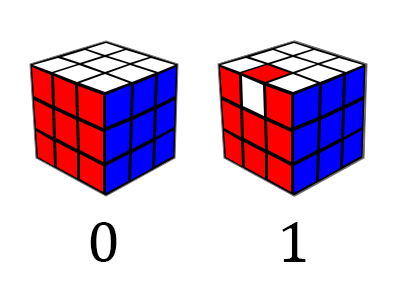

For most people, solving a Rubik's cube alone is a virtually impossible task. That's hardly surprising&mdash;the humble puzzle can exist in over 43 quintillion states (an order of magnitude greater than the number of grains of sand on Earth!). Yet in just a few hours, you can train yourself to solve *every one* of those configurations using some basic intuition and a little bit of memorization. A few more days of practice, and you might find yourself consistently solving the cube in under a minute.

However, there is an even greater challenge than solving the cube quickly: solving it using the fewest moves possible. Our ultimate goal is to identify the shortest solution possible, a feat that is virtually impossible for us mere mortals. We'll have to turn to computers if we want to solve this problem.

Before we start worrying about how to solve the cube, let's take a moment to get acquainted with its mechanical inner workings.

<figure style="max-width: 1080px">
    
    <figcaption>A disassembled MoYu RS3 M 2021</figcaption>
</figure>

Upon disassembling the cube, we see that it is *not* composed of smaller cubes. Rather, at its core lies an immobile plastic skeleton to which the center pieces are attached. The centers are restricted to rotating in place, meaning that the position of the centers relative to each other never changes. Around the center are eight corner and twelve edge pieces (or "cubies", in cuber lingo). We will primarily be focused on the position and orientation of these mobile cubies.

## A Quick Guide to Notation

For those not familiar, the notation used by cubers to describe moves of the cube is quite simple. Each move consists of a letter representing the face being turned (**U**p, **D**own, **L**eft, **R**ight, **F**ront, or **B**ack).

After this letter, there may be a symbol indicating the degree of the turn. An unembellished letter is taken to mean a clockwise 90&deg; turn, a "2" indicates a 180&deg; turn, and an apostrophe (read as "prime", a convention taken from mathematics) signifies a counterclockwise 90&deg; turn.

# Thinking with Cubies

Now that we have some insight on the inner workings of the cube, we can start building an abstract representation of the puzzle that our solver can work with. The position of the cubies can be easily tracked using arrays of size 8/12 to record which piece is occupying which slot. However, the cubies can also be in different orientations, which we must also keep track of. This requires us to establish some conventions.

## Corner Orientation

Each corner has three possible orientations. We call the default orientation the piece has in its solved position $0$. Twisting the piece clockwise yields an orientation of $1$, and another clockwise twist gives an orientation of $2$. Three twists of the corner brings us back to the starting position.



That' fine and dandy if all we're doing is twisting a corner in place, but actual moves also change the position of the pieces. How do we define a corner's orientation when it's not in its original spot?

The key observation is that a corner cubie will always be in either the top (white) or the bottom (yellow) layer. If it's in its original layer, nothing changes. If it's in the opposite layer, we pretend that the white sticker is yellow (or vice versa). Therefore, if the white sticker is facing down, the corner orientation is $0$. Thus, U/D moves and double moves do not affect corner orientation.

## Edge Orientation

If you are a cuber, you may be familiar with the concept of edge orientation. However, we actually use a slightly different edge orientation convention than the one most speedsolvers are accustomed to, for reasons that will be explained later in the article. Here's how it works.

Each edge has two stickers; we pick one of them to be the "key sticker". For the edges in the slice sandwiched between the front and back layers, the key sticker is white/yellow; for edges between the top and bottom layers, we choose red/orange, and the edges between the left and right layers use green/blue.

To determine the orientation of an edge, we check if its key sticker is facing the same way as the key sticker of the edge that occupies that spot when the cube is solved. The orientation of the edge is $0$ if it's facing the same way, and $1$ if it isn't.



If that doesn't make any sense, consider a practical example. Let's look at the white-orange edge on a solved cube. The key sticker of this edge is white. If we do an L move, the edge moves to the spot that was once occupied by the orange-green edge. The white sticker is *not* facing orange, so the edge's orientation is now $1$. From this, you can deduce that any quarter turn will flip the orientation of all affected edges, while a double turn will not affect edge orientation.

Using this information, we can create a structure to represent a cube.

```c
struct Cube {
    uint8_t corners[8];
    uint8_t corner_twist[8];
    uint8_t edges[12];
    uint8_t edge_flip[12];
};
```

We can also calculate the number of possible cubes:

$$\underbrace{12! \times 2^{12}}_\text{edges} \times \underbrace{8! \times 3^8}_\text{corners} = 519,024,039,293,878,272,000$$

*Wait a minute*, you might be asking. This result is clearly bigger than the 43 quintillion figure cited earlier. What gives? The answer is that not every combination of pieces can be solved. Let's examine the conditions that determine whether a position can be solved.

# Permutations

In mathematics, a permutation is an ordered list of elements so that each element only appears once. Ignoring cubies for a moment, we can think of the 48 stickers on the surface of the Rubik's cube as members of a permutation.

How do we actually realize the notion of a permutation? We can accomplish this by treating permutations as functions. Suppose $S$ is the set of all elements contained in our permutation. A permutation would then be a bijection of $S$, or a function that maps every member of $S$ onto another member of $S$ so that

* no two inputs map to the same output, and
* no two outputs map to the same input (each input only maps to one output)

For example, the permutation $(3\;1\;2)$ can be written as a function $f$ where $f(1) = 3$, $f(2) = 1$, and $f(3) = 2$.


Since permutations are just functions, they can be composed. The result is another bijection of $S \rightarrow S$, or another permutation. We can model applying a move to a cube as composing the permutation of the cube with the permutation of the move.

Let's look at the set of all permutations with $n$ objects, which we'll call $G$. This set has some special properties:

* Composing two elements of $G$ always yields another element of $G$. Furthermore, this operation is associative, or $a \cdot (b \cdot c) = (a \cdot b) \cdot c$(since function composition is always associative).
* There exists an element $e$ in $G$ so that, for every $x$ in $G$, $x \cdot e = e \cdot x = x$. We call this the identity element. For example, if the elements of the permutation are the integers $1$ to $n$, the identity permutation is $(1\;2\;3\;\ldots\;n)$.
* For every $x$ in $G$, there is some element $x^{-1}$ (the inverse) so that $x \cdot x^{-1} = x^{-1} \cdot x = e$.

Any set and binary operation that fulfill these properties forms a mathematical structure known as a [group](https://en.wikipedia.org/wiki/Group_(mathematics)). Indeed, the set of all Rubik's cube positions forms a group known as the [cube group](https://en.wikipedia.org/wiki/Rubik%27s_Cube_group). The identity element is the solved cube, and any member of the cube group can be written as the product of the elements $\{U, D, L, R, B, F\}$ representing the six basic moves. The cube group is a subgroup of symmetric group $\mathrm{S}_{48}$, which contains all permutations of size $48$.

<aside>

[Cayley's theorem](https://en.wikipedia.org/wiki/Cayley%27s_theorem) states that *any* group is isomorphic to a subgroup of a permutation group. This isn't really important to know for our application, but I think that it's a pretty cool insight.

</aside>

A permutation where two elements are swapped but all other elements remain the same is known as a **transposition**. Any permutation can be written as the product of a series of transpositions. This gives rise to an interesting result: every permutation can either be written as the product of an even number of transpositions or an odd number of transpositions. We call these permutations *even* and *odd*, respectively, and this property of a permutation is known as its parity.

The parity of a permutation behaves similarly to the parity of integers. Specifically, the product of two even permutations is always even. We know that the permutation of a solved cube is even, since it is the result of zero transpositions. Furthermore, each of the elementary moves that can be performed on the cube has even parity, meaning that the overall parity of the cube is always even. Thus, a cube with odd parity can never be solved, since it is impossible to turn an odd permutation into an even one by composing even permutations.

<figure style="max-width: 256px">
    
    <figcaption>This position where two edges have been switched is unsolvable, since it has odd parity.</figcaption>
</figure>

There are further restrictions on which positions are solvable due to piece orientation. For example, we know that quarter turns flip the orientation of every edge involved. Thus, the sum of the edge orientation values of the cube must always be even. Similarly, the overall change in corner orientation due to a move is always a multiple of three, meaning that the total corner orientation is always divisible by three.

<figure style="max-width: 360px">
    
    <figcaption>No sequence of moves can flip a single edge or twist a single corner.</figcaption>
</figure>

With our newfound knowledge of the laws of the cube, we can rewrite our original expression:

$$\underbrace{\frac12}_\text{parity} \times \underbrace{12! \times 2^{11}}_\text{edges} \times \underbrace{8! \times 3^7}_\text{corners} = 43,252,003,274,489,856,000$$

We know that all positions meeting our criteria can be solved, since we can devise sequences of moves ("algorithms" in cuber lingo) that manipulate portions of the cube while leaving the rest undisturbed. By repeatedly applying these algorithms, solving any state becomes trivial, though of course the solution is not optimal.

# The Search Algorithm

Now that we have thoroughly explored the practical details of representing the cube, we can start thinking about how we're actually going to find an optimal solution.

For starters, we can recognize that optimally solving a Rubik's cube is a graph search problem. Each possible state is a vertex in the graph, with the edges between vertices representing moves that transform one state into another.

The problem is that the number of nodes we need to process grows exponentially with the number of moves from the starting position. For any state, there are 18 distinct moves that we could apply to the cube&mdash;6 faces times three different degrees of turning (clockwise, 180&deg;, and counterclockwise). 

<aside>

There are some simple optimizations that marginally reduce the branching factor, as outlined by Richard Korf in his seminal 1997 paper *Finding Optimal Solutions to Rubik's Cube Using Pattern Databases*:

> Since twisting the same face twice in a row is redundant, ruling out such
moves reduces the branching factor to 15 after the first move. Furthermore, twists of opposite faces of the cube are independent and commutative. For example, twisting the front face, then twisting the back face, leads to
the same state as performing the same twists in the opposite order. Thus, for each pair of opposite faces we arbitrarily chose an order, and forbid moves that twist the two faces consecutively in the opposite order. This results in a search tree with an asymptotic branching factor of about 13.34847. 

</aside>

Breadth-first search has no chance of working, since storing the search frontier in my computer's puny 16 GB of RAM would become infeasible once we reach around depth 10. (For reference, the median length of the optimal solution for a random position is 18.)

The alternative is to use depth-first search. A simple DFS does not work because the tree is infinite, so we must set a depth limit. In order to guarantee optimality, we can start with a depth limit of zero and successively increase the limit until a solution is found. This algorithm is called [iterative deepening depth-first search](https://en.wikipedia.org/wiki/Iterative_deepening_depth-first_search) (IDDFS).

IDDFS still explores every possible state, which we need to avoid if we want an answer within the next century. What we need is some heuristic that tells us which parts of the tree don't need to be searched.

## The Art of Pruning

We can augment depth-first search using some function that gives a lower bound on the distance of a position from the solved state. When evaluating a node in our search, if the current search depth plus the value of the heuristic exceeds the depth limit, we know that the optimal solution cannot possibly be contained in a subtree of that node and can skip searching it. This combination of IDDFS and a heuristic is known as [iterative deepening A*](https://en.wikipedia.org/wiki/Iterative_deepening_A*) (IDA*).


The heuristic must never overestimate the number of moves it will take to solve a position, or else we may accidentally stop searching a branch that contains a solution. This condition is called *admissibility*. How do we construct an admissible heuristic?

Ideally, we would have a lookup table that recorded the number of moves required to solve every possible state. However, such a table would be much too large to construct or store. Instead, we can compute the amount of moves necessary to solve *part* of the cube.

For example, let's say we ignored the edges of the cube and focused our attention on the corners, essentially treating the cube as a 2x2x2. The corners can exist in $8! \times 3^7 = 88,179,840$ different ways; we could explore the entire problem space in a short amount of time, producing a table that tells us the number of moves necessary to solve any configuration of corners. When solving the cube, we can use the value given by the table as our heuristic. This value is clearly admissible since the number of moves needed to solve the corners will always be less than or equal to the number of moves needed to solve the entire cube. 

To accomplish this, we need to figure out a way to map the corner configuration of a cube to a table index. We can break this down into two subproblems:

- Mapping corner orientation to an integer
- Mapping corner permutation to an integer

Creating an index for corner orientation is fairly easy; we can treat the corner orientation values as digits of a base-3 number, giving us our index.

```c
int compute_co_coord(struct Cube *cube) {
    int coord = 0, base = 1;
    for(int i = 0; i < 7; i++) {
        coord += cube->corner_twist[cube->corners[i]] * base;
        base *= 3;
    }
    return coord;
}
```

<aside>

We call these indexes "coordinates", the term used by most existing cube literature. Don't let this confuse you; they do not represent points in space.

</aside>

Encoding a permutation as an integer is slightly more challenging. How this can be accomplished is outside the scope of this article, although if you want to learn about the solution, the term you want to Google is [Lehmer code](https://en.wikipedia.org/wiki/Lehmer_code). Ben Botto, who also made an optimal Rubik's cube solver, wrote a delightful [article](https://medium.com/@benjamin.botto/sequentially-indexing-permutations-a-linear-algorithm-for-computing-lexicographic-rank-a22220ffd6e3) going into the details of computing these codes.

To generate the actual pruning table, we just perform a breadth-first search starting from the solved position until the table is full. Since we're operating on coordinates, we don't actually need to use a full cube representation in pruning table construction. Instead, we can construct lookup tables that map coordinates and moves to coordinates directly. This considerably speeds up pruning table generation.

Of course, a pruning table based on the corners alone is too underpowered for our purposes. A table that incorporates more information about the cube's state will produce estimates closer to the true value of the heuristic function, which will enable us to prune more nodes from our search. 

In practice, we quickly run into problems with memory usage. Adding edge orientation info to our table increases its size by 2048&times; to over 180 billion entries, which greatly exceeds the total memory of my computer. We'll need to take measures to shrink its size back down to something that I can feasibly use.

# Symmetry Reduction

Here's a bit of an experiment that you can try if you happen to own two or more cubes. Let's say we apply the same sequence of scrambling moves to both cubes, except we hold them in different initial orientations. Take a look at the result&mdash;notice anything unusual?


Look carefully, and you'll see that the two cubes have same underlying pattern, but a different color scheme. White is replaced with red, green with blue, yellow with orange, and so on. Intuitively, 
they should be solvable in the same number of moves too, since there is a 1:1 correspondence on moves between the two cubes. Thus, they could be represented by a single entry in the pruning table.

Just how many of these symmetry-equivalent variants exist for a given position? Well, there are 24 different ways we could hold the cube when scrambling, times two because can mirror the scrambling moves, yielding up to 48 symmetry-equivalent siblings. A small portion of positions have fewer than 48 symmetry equivalents because they remain unchanged under reflection/rotation from certain angles. If we only stored one entry for all the symmetry equivalents of a given state, we can effectively decrease the size of our pruning table by almost 48&times;.

Let's flesh out the details a little more. Let $A$ be the position represented by the scrambling moves that we applied to the cube earlier. If $S$ is one of the 48 symmetries, the position given by $SAS^{-1}$ will be symmetry-equivalent to $A$. This can be written as $A \sim B$.

Symmetry-equivalence has the following properties:

* **Reflexivity:** Position $A$ is always symmetry-equivalent to itself.
* **Symmetry:** If position $A \sim B$, $B \sim A$.
* **Transitivity:** If $A \sim B$ and $B \sim C$, $A \sim C$.

Because symmetry-equivalence fulfills these three properties, it is an [equivalence relation](https://en.wikipedia.org/wiki/Equivalence_relation), meaning that it partitions the cube group into disjoint sets of symmetry-equivalent cubes. We call these sets **equivalence classes**.

There are a number of things we need to do to actually incorporate symmetry into our table construction.

## Reflection

Right now, our corner orientation model is incapable of describing reflection. We need to extend it to support all 48 symmetries. 

First, an interesting insight. The three possible corner orientations ($0$, $1$, and $2$) combined with the operation of addition mod 3 forms a group. We can describe the group operation using a table:

<div class="table-1st-col-border">

| $+$      | $0$ | $1$ | $2$ |
|----------|-----|-----|-----|
| $0$      | $0$ | $1$ | $2$ |
| $1$      | $1$ | $2$ | $0$ |
| $2$      | $2$ | $0$ | $1$ |

</div>

Such a table is called a [Cayley table](https://en.wikipedia.org/wiki/Cayley_table). The group operation is not necessarily commutative, so the first operand is taken to be the row, while the second represents the column.

In order to handle reflection, we're going to invent three new corner orientations that exist solely in the "mirror world", which we will call $0_R$, $1_R$, and $2_R$. Our addition table now looks like this:

<div class="table-1st-col-border">

| $+$      |  $0$  |  $1$  |  $2$  | $0_R$ | $1_R$ | $2_R$ |
|----------|-------|-------|-------|-------|-------|-------|
| $0$      |  $0$  |  $1$  |  $2$  |  $\color{red}?$  |  $\color{red}?$  |  $\color{red}?$  |
| $1$      |  $1$  |  $2$  |  $0$  |  $\color{red}?$  |  $\color{red}?$  |  $\color{red}?$  |
| $2$      |  $2$  |  $0$  |  $1$  |  $\color{red}?$  |  $\color{red}?$  |  $\color{red}?$  |
| $0_R$    |  $\color{red}?$  |  $\color{red}?$  |  $\color{red}?$  |  $\color{red}?$  |  $\color{red}?$  |  $\color{red}?$  |
| $1_R$    |  $\color{red}?$  |  $\color{red}?$  |  $\color{red}?$  |  $\color{red}?$  |  $\color{red}?$  |  $\color{red}?$  |
| $2_R$    |  $\color{red}?$  |  $\color{red}?$  |  $\color{red}?$  |  $\color{red}?$  |  $\color{red}?$  |  $\color{red}?$  |

</div>

Now, we just need to fill out the rest of the table using some reasoning. For starters, $0$ is the identity element, so we can fill out all operations involving $0$.

<div class="table-1st-col-border">

| $+$      |  $0$  |  $1$  |  $2$  | $0_R$ | $1_R$ | $2_R$ |
|----------|-------|-------|-------|-------|-------|-------|
| $0$      |  $0$  |  $1$  |  $2$  |  $\color{blue}0_R$  |  $\color{blue}1_R$  |  $\color{blue}2_R$  |
| $1$      |  $1$  |  $2$  |  $0$  |  $\color{red}?$  |  $\color{red}?$  |  $\color{red}?$  |
| $2$      |  $2$  |  $0$  |  $1$  |  $\color{red}?$  |  $\color{red}?$  |  $\color{red}?$  |
| $0_R$    |  $\color{blue}0_R$  |  $\color{red}?$  |  $\color{red}?$  |  $\color{red}?$  |  $\color{red}?$  |  $\color{red}?$  |
| $1_R$    |  $\color{blue}1_R$  |  $\color{red}?$  |  $\color{red}?$  |  $\color{red}?$  |  $\color{red}?$  |  $\color{red}?$  |
| $2_R$    |  $\color{blue}2_R$  |  $\color{red}?$  |  $\color{red}?$  |  $\color{red}?$  |  $\color{red}?$  |  $\color{red}?$  |

</div>

When we reflect a position, we are composing the mirror image of the solved cube with that position. For corners, this amounts to adding the corner orientation to $0_R$.

The main idea is that a regular clockwise twist of a corner is an anticlockwise twist in the mirror world. Thus, an orientation of $0$ is still $0_R$ when mirrored, while $1$ becomes $2_R$ and $2$ becomes $1_R$. We can put these results in the table:

<div class="table-1st-col-border">

| $+$      |  $0$  |  $1$  |  $2$  | $0_R$ | $1_R$ | $2_R$ |
|----------|-------|-------|-------|-------|-------|-------|
| $0$      |  $0$  |  $1$  |  $2$  |  $0_R$  |  $1_R$  |  $2_R$  |
| $1$      |  $1$  |  $2$  |  $0$  |  $\color{red}?$  |  $\color{red}?$  |  $\color{red}?$  |
| $2$      |  $2$  |  $0$  |  $1$  |  $\color{red}?$  |  $\color{red}?$  |  $\color{red}?$  |
| $0_R$    |  $0_R$  |  $\color{blue}2_R$  |  $\color{blue}1_R$  |  $\color{red}?$  |  $\color{red}?$  |  $\color{red}?$  |
| $1_R$    |  $1_R$  |  $\color{red}?$  |  $\color{red}?$  |  $\color{red}?$  |  $\color{red}?$  |  $\color{red}?$  |
| $2_R$    |  $2_R$  |  $\color{red}?$  |  $\color{red}?$  |  $\color{red}?$  |  $\color{red}?$  |  $\color{red}?$  |

</div>

You can reason about the rest of the table, but honestly it's easier to use an actual Rubik's cube and mirror. Here's what the full table looks like:

<div class="table-1st-col-border">

| $+$      |  $0$  |  $1$  |  $2$  | $0_R$ | $1_R$ | $2_R$ |
|----------|-------|-------|-------|-------|-------|-------|
| $0$      |  $0$  |  $1$  |  $2$  |  $0_R$  |  $1_R$  |  $2_R$  |
| $1$      |  $1$  |  $2$  |  $0$  |  $1_R$  |  $2_R$  |  $0_R$  |
| $2$      |  $2$  |  $0$  |  $1$  |  $2_R$  |  $0_R$  |  $1_R$  |
| $0_R$    |  $0_R$  |  $2_R$  |  $1_R$  |  $0$  |  $2$  |  $1$  |
| $1_R$    |  $1_R$  |  $0_R$  |  $2_R$  |  $1$  |  $0$  |  $2$  |
| $2_R$    |  $2_R$  |  $1_R$  |  $0_R$  |  $2$  |  $1$  |  $0$  |

</div>

There's actually a name for this type of group&mdash;$\mathrm{D}_3$, one of the [dihedral groups](https://en.wikipedia.org/wiki/Dihedral_group). Dihedral groups describe the symmetries of a regular polygon under reflection and rotation, so you can probably see how they are readily applicable to our use case.

## The Inverse

There's another trick that we can use to further boost our pruning. Suppose $S$ is the sequence of moves that creates some position. We know that there is some sequence of moves $S^{-1}$ such that $S \times S^{-1}$ produces the solved state. Because of this relationship, we call $S^{-1}$ the *inverse* of $S$. These two positions must be at the same distance, but our pruning table might have a greater value for $S^{-1}$ than $S$. Thus, we can look up both positions and take the maximum of both lookups as the value of the heuristic, potentially boosting our pruning.

