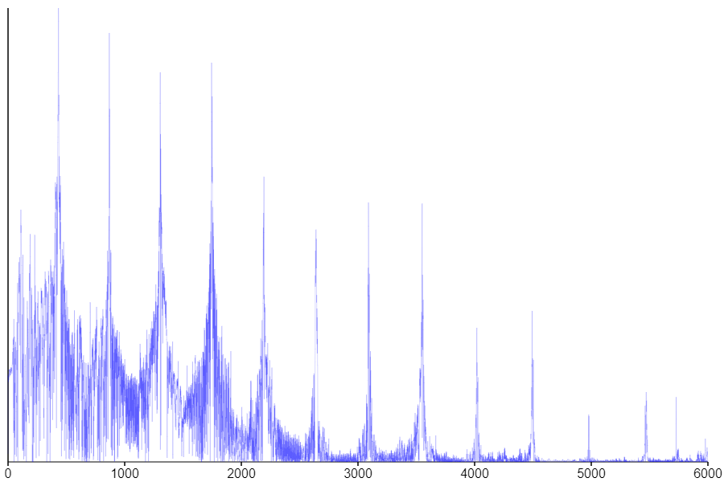

You can tuna fish, but you can't tuna piano. Wait, what?

Okay, that's not quite true. You *can* tune a piano, but only approximately. It turns out that the mathematics behind the 12-tone scale used in most Western music hides some sinister secrets.

Let's start with the basics. Behind every key on a piano are 1&ndash;3 strings, which have been tensioned so that when the strings are struck they will ring out at a specific frequency. Each note is associated with a distinct frequency, and keys are arranged such that the frequency (pitch) of the notes increases from left to right.

Of course, the burning question remains: how do we know what frequency to assign to each note? The answer to this is pretty nuanced, but luckily we get one freebie. Every tuning system starts by assigning a specific frequency to an arbitrary key to use as a reference point; we call this the pitch standard. The most common pitch standard in modern times is A440, which sets the frequency of the first A above middle C to 440 Hz.

Now, let's do a little experiment. This is what it sounds like if I play A4 on my piano.

<audio controls src="a4.mp3"></audio>

Ironically, my piano is pretty badly out of tune, but that doesn't matter for this demonstration. I can use [a bit of math](https://en.wikipedia.org/wiki/Fourier_transform) to take the sound and dissect it into the individual frequencies that make it up, kind of like how a prism can split light into its color components:

<figure>
    
    <figcaption>Disclaimer: the y-axis is a log scale. In reality, the harmonics after the first one are a lot weaker.</figcaption>
</figure>

There's a big peak representing the main frequency, but there are also a bunch of extra peaks, which are known as overtones or partials. The reason for their production has to do with the physics of string vibration. Essentially, a string that is fixed at both ends is limited to vibrating at integer multiples of its fundamental frequency; these patterns of vibration are called *resonant modes*. Together, these modes form the harmonic series.

When a string is struck or plucked, the resulting vibration contains multiple of these resonant modes, creating a complex spectrum like the one that we observed. The same phenomenon is actualy exhibited by many other oscillating systems besides strings. For example, air in a tube is also confined to resonating at multiples of the tube's fundamental frequency. This is why, for a given fingering, a French horn player is restricted to playing notes within the harmonic series. 

TODO-Explain relationship between intervals and harmonic series.

<canvas id="harmonics" width="700" height="700"></canvas>
<button onclick="play()">Play</button>

